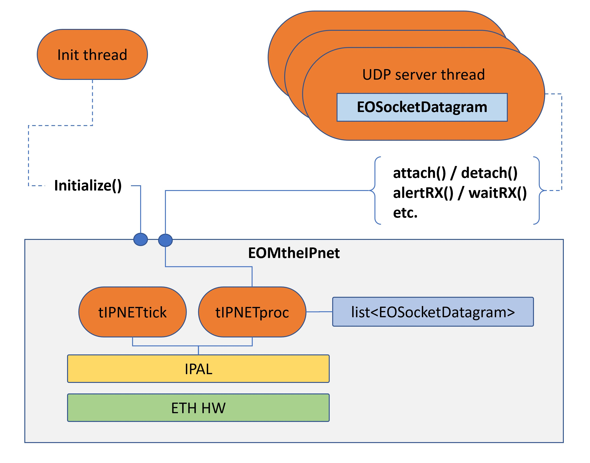
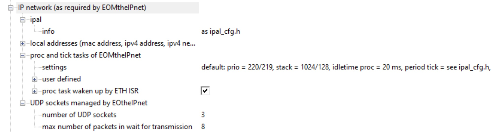

## EOMtheIPnet


In here is a very basic scheme of how the `EOMtheIPnet` and the `EOSocketDatagram` works in the ETH boards such as the `ems`, `mc4plus` and `mc2plus` and how it offer a socket service.


#### The great picture

The `EOMtheIPnet` is a singleton which runs two threads, manages calls to `IPAL`, accepts the handling of a number of sockets which it maintains inside an internal list.

It is initialized only once by a Init thread and used by as many threads one wants (clearly in a thread safe manner!) to offer some services. The most important service is the management of datagram sockets.




**Figure**. The internals of `EOMtheIPnet` and how a `EOSocketDatagram` interacts with it.


The `Initialise()` method of `EOMtheIPnet` initializes the IPAL library and starts two threads: the `tIPNETtick` and the `tIPNETproc`. 

The `tIPNETtick` is a periodic thread which has the simple burden to regularly call the IPAL's function `ipal_sys_timetick_increment()` which gives accurate timings to the IP stack.  

The `tIPNETproc` is an event based thread which has much more complex responsibilities, the most important of which is to call the IPAL's processing function `ipal_sys_process_communication()`. The others are to process requests from an external socket object `EOSocketDatagram`.

#### The IPAL processing

It is done by calling `ipal_sys_process_communication()`. That must be done as most frequently as possible, but not too much otherwise the systems ends up in starvation. The solution has been to call it at least every given amount of time and also whenever a resource makes a direct request.

The given amount of time is configurable with variable `eOmipnet_cfg_t::procmaxidletime` and on `ems` board has a value of 20 ms. That means that the `tIPNETproc` thread runs at least every 20 ms.

The above mechanism cannot guarantee the sub-millisecond responsiveness tha iCub requires, so there is an further wakeup mechanism. The thread `tIPNETproc` is waken up in other two cases.

- When the ETH IRQ handler receives a frame. In this case it is important to process the frame as soon as possible. The frame can contain a ping to which a reply is required or also a UDP packet to be delivered to upper layers. 
- When a user thread makes a direct request.  For instance it may need to send a ARP frame, to transmit a UDP frame through a `EOSocketDatagram` object or whatever else.

For the above cases the event based thread is activated by a relevant event whose value is contained inside the following data structure.

```C++
typedef enum
{
    eov_ipnet_evt_tick                  = 0x00000001,     
    eov_ipnet_evt_RXethframe            = 0x00000002,   
    eov_ipnet_evt_CMD2process           = 0x00000004,   
    eov_ipnet_evt_CMD2stop              = 0x00000008,  
    eov_ipnet_evt_TXdatagram            = 0x00000010   
} eOv_ipnet_event_t;
```

**Code Listing**. The events which may asynchronously wake up the `tIPNETproc` thread.


#### The managing of user sockets

It is done through the object `EOSocketDatagram`. A thread can create such an object, assign it some properties such as a callback on reception or on executed transmission and then can attach it to the `EOMtheIPnet`. After that, it will be the `tIPNETproc` which will call the relevant functions of the IPAL library, for instance to perform connection of the socket to an IP address through ARP, to transmit an UDP packet, to execute processing of a received UDP packet and to call the associated callback.   

##### Transmission

When we want to transmit a packet `EOpacket` we use  `EOSocketDatagram`'s function `eo_socketdtg_Put()`  which is non-blocking.  Internally it calls the function `eov_ipnet_Alert()` which stores inside an RTOS FIFO the packet pointer and sends and event `eov_ipnet_evt_TXdatagram` to the `tIPNETproc` so that it can wake up. 

The thread `tIPNETproc` does what it must and eventually calls IPAL's `ipal_udpsocket_sendto()` which is the one responsible to deliver the UDP frame to the network.

This mechanism also allows multiple threads to do simultaneous transmission requests as long as they are done over different sockets or if they protect the call of `eo_socketdtg_Put()`  with a mutex.

##### Reception

When the `tIPNETproc` thread is waken up by the event `eov_ipnet_evt_RXethframe` sent by the ETH IRW handler,  the thread executes  `ipal_sys_process_communication()`.  In case the frame is of UDP type and the receiving port is registered to an internal `EOSocketDatagram` the thread  calls internal function `s_eom_ipnet_OnReceptionDatagram()` which copies the packet inside a FIFO reserved for the socket and executes the associated callback. 

At this time, typically, a thread is alerted by the callback and it retrieves the packet from the FIFO with function `eo_socketdtg_Get()`.


#### Configurability of `EOMtheIPnet`

The `EOMtheIPnet` can be configured only at startup through its `Initialize()` function. As such it can be configured to host a fixed maximum number of internal sockets and a maximum number of datagrams enqueued for transmission.

See in here the configuration of the ems board. We have a maximum of three sockets (`control`, `diagnostics2`, `listener`) and a maximum of 8 UDP frames in the TX queue in waiting that `tIPNETproc` gets them for transmission.



**Figure**. Object `EOMtheIPnet`as configured for the `ems` / `mc4plus` / `mc2plus` boards.


#### Configurability of each `EOSocketDatagram`

The transmission and reception capability is mostly inside each `EOSocketDatagram` object and is declared at creation time by method `eo_socketdtg_New()`.

If the socket is bidirectional, then we can configure the size of both the input and output FIFOs. We can specify the the maximum number of bytes managed by the UDP frame and the capacity of the FIFO.

```c++
// symmectric socket 
skt1 = eo_socketdtg_New(
    		2, 1500, eom_mutex_New(), // input fifo: 2 packets of 1500 bytes max
      		2, 1500, eom_mutex_New()  // output fifo: 2 packets of 1500 bytes max
            ); 
// asymmectric socket 
skt2 = eo_socketdtg_New(
    		10, 200, eom_mutex_New(), // input fifo: 10 packets of 200 bytes max
      		2, 1500, eom_mutex_New()  // input fifo: 2 packets of 1500 bytes max
            );   
```

**Code listing**. Two different initializations for a `EODatagramSocket`. The first socket is a simmetric socket and holds only a few medium sized packets both in input and in output. The second holds many small packets in reception and only a few in transmission but bigger in size. 


Further configurability can be done when the socket is opened with function `eo_socketdtg_Open()`. Or even when reopened after a close.

In here we can for instance specify the listening port, the direction, if it is a blocking socket in reception, teh actions on receptions and after transmission. 

```c++
eo_action_SetCallback(s_action_ethcmd, alertserverthread, nullptr, nullptr);
eo_socketdtg_Open(skt1, 3333, eo_sktdir_TXRX, eobool_false, NULL, s_action_ethcmd, NULL); 
```

**Code listing**. An example of  eo_socketdtg_Open() of a socket on port 3333 that is bidirectional, non-blocking and that on reception of a frame ensures that function alertserverthread() is called to alert the owning thread. 
