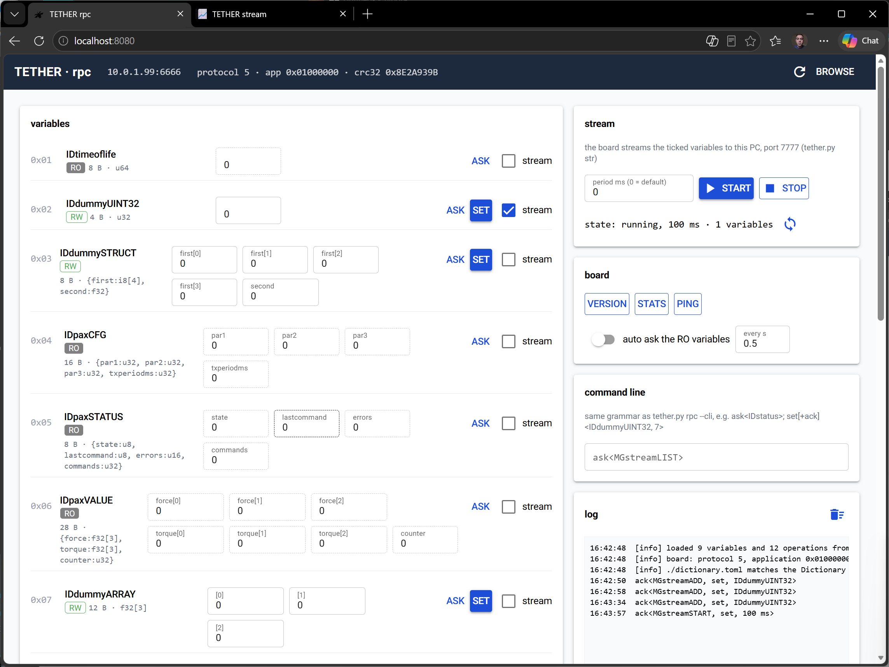
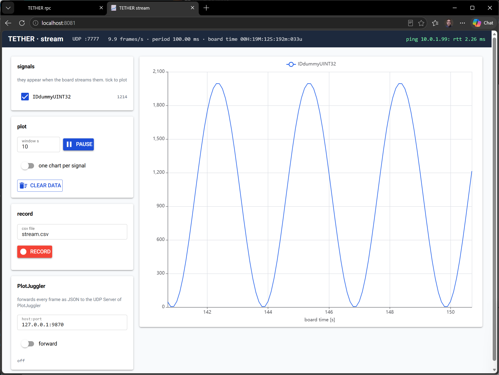

# TETHER host: how to install and run

`tether.py` and `tethercodec.py` must stay in the same folder. Python 3.11 or later is required.

## Install (once)

```bash
cd
python3 --version                       # 3.11 or later
sudo apt install python3 python3-venv   # only if venv is missing
python3 -m venv ~/.venv
~/.venv/bin/pip install nicegui
```

## Run: text interface (`--cli`)

Needs only Python (no nicegui).

```bash
cd <folder with tether.py>
python3 tether.py rpc --ip 10.0.1.99 --cli                  # variables and operations, from a prompt
python3 tether.py str --ip 10.0.1.99 --cli --log stream.csv # the stream: text summary and csv
```

At the `rpc` prompt: `list`, `ask<IDtimeoflife>`, `run[+ack]<OPgetUptime>`, `help`, `quit`.


```bash
acemor@IITICB002LW038:~/amcmj1.gtw/tether$ python3 tether.py rpc --ip 10.0.1.99 --cli
[info] loaded 9 variables and 12 operations from ./dictionary.toml
[info] board: protocol 5, application 0x01000000, 9 variables, 12 operations, up to 32 ROPs per frame, dictionary crc32 0x8E2A939B
[info] ./dictionary.toml matches the Dictionary of the board
[info] tether rpc is connected to 10.0.1.99:6666 and is ready to accept ROPs
       write up to 32 ROPs each one separated by a ; and send them by hitting return
> list
  variables:
    IDtimeoflife             0x01   8 B  RO  u64
    IDdummyUINT32            0x02   4 B  RW  u32
    IDdummySTRUCT            0x03   8 B  RW  {first:i8[4], second:f32}
    IDpaxCFG                 0x04  16 B  RO  {par1:u32, par2:u32, par3:u32, txperiodms:u32}
    IDpaxSTATUS              0x05   8 B  RO  {state:u8, lastcommand:u8, errors:u16, commands:u32}
    IDpaxVALUE               0x06  28 B  RO  {force:f32[3], torque:f32[3], counter:u32}
    IDdummyARRAY             0x07  12 B  RW  f32[3]
    IDdummyMODE              0x08   1 B  RW  u8
    IDdummyCLOCK             0x09  16 B  RO  {microseconds:u64, seconds:u32}
  operations:
    OPmanageLED              0xC0   2 B      {led:u8, on:bool}                         run[+ack]<OPmanageLED, {led=.., on=..}>
    OPpaxINIT                0xC1  16 B      {par1:u32, par2:u32, par3:u32, txperiodms:u32}  run[+ack]<OPpaxINIT, {par1=.., par2=.., par3=.., txperiodms=..}>
    OPpaxDEINIT              0xC2   0 B      -                                         run[+ack]<OPpaxDEINIT>
    OPpaxSTART               0xC3   0 B      -                                         run[+ack]<OPpaxSTART>
    OPpaxSTOP                0xC4   0 B      -                                         run[+ack]<OPpaxSTOP>
    OPgetUptime              0xC5   0 B      - -> seconds:u32                          run[+ack]<OPgetUptime>
    OPreadRegister           0xC6   1 B      address:u8 -> value:u32                   run[+ack]<OPreadRegister, address>
    OPsetMode                0xC7   1 B      mode:u8                                   run[+ack]<OPsetMode, mode>
    OPgetClock               0xC8   0 B      - -> {microseconds:u64, seconds:u32}      run[+ack]<OPgetClock>
    OPadd                    0xC9   4 B      {a:i16, b:i16} -> sum:i32                 run[+ack]<OPadd, {a=.., b=..}>
    OPdivide                 0xCA   4 B      {a:i16, b:i16} -> {quotient:i32, remainder:i32}  run[+ack]<OPdivide, {a=.., b=..}>
    OPaverage                0xCB  12 B      values:f32[3] -> mean:f32                 run[+ack]<OPaverage, [values0, values1, values2]>
  management:
    MGstreamADD              0xE0   1 B      u8
    MGstreamREM              0xE1   1 B      u8
    MGstreamLIST             0xE2   0 B      raw
    MGstreamSTART            0xE3   2 B      u16
    MGstreamSTOP             0xE4   0 B      raw
    MGbrowseINFO             0xE8   0 B      raw
    MGbrowseITEM             0xE9   0 B      raw
    MGbrowseFIELD            0xEA   0 B      raw
    MGversion                0xF0   0 B      raw
    MGstats                  0xF1   0 B      raw
  dictionary: protocol 5, application 0x01000000, crc32 0x8E2A939B
>
```

# Streaming IDdummyUINT32 from the command line

You need two terminals. Start `str` first.

## Terminal 1: the receiver (it also keeps the stream alive)

```bash
python3 tether.py str --ip 10.0.1.99 --cli
```

It prints a summary every second. Add `--log stream.csv` to save a csv, or `--all` to see every frame.

## Terminal 2: the `rpc` prompt

```
python3 tether.py rpc --ip 10.0.1.99 --cli
> set[+ack]<MGstreamADD, IDdummyUINT32>
> set[+ack]<MGstreamSTART, 0>
```

`MGstreamSTART` with `0` uses the default period of 100 ms. For a different period give the milliseconds (1 to 10000), for example `set[+ack]<MGstreamSTART, 20>`.

Expected replies: `ack<MGstreamADD, set, IDdummyUINT32>` and `ack<MGstreamSTART, set, 100 ms>`.
In terminal 1 the value appears: a sine between 0 and 2000 with a period of 3 s.


```

acemor@IITICB002LW038:~/amcmj1.gtw/tether$ python3 tether.py str --ip 10.0.1.99 --cli --log stream.csv
[info] loaded 9 variables and 12 operations from ./dictionary.toml
[info] tether str listens on UDP port 7777 from 10.0.1.99. ctrl-c to stop
[info] it pings 10.0.1.99:7777 every 2 s to keep the stream alive
[info] no stream frames: waiting ...
[info] logging 1 variable to stream.csv
[info]     1.9 frames/s, period min 99994 / mean 99994 / max 99994 us, board time 00H:11M:09S:724m:036u
    sig<IDdummyUINT32, 1995>
[info]    10.0 frames/s, period min 99986 / mean 100000 / max 100014 us, board time 00H:11M:10S:724m:036u
    sig<IDdummyUINT32, 588>
[info]    10.0 frames/s, period min 100000 / mean 100000 / max 100000 us, board time 00H:11M:11S:724m:036u
    sig<IDdummyUINT32, 417>
[info]     9.5 frames/s, period min 99986 / mean 100000 / max 100014 us, board time 00H:11M:12S:724m:036u
    sig<IDdummyUINT32, 1995>
[info]    10.0 frames/s, period min 100000 / mean 100000 / max 100000 us, board time 00H:11M:13S:724m:036u
    sig<IDdummyUINT32, 588>
```


## Check and stop (in terminal 2)

```
> ask<MGstreamLIST>          # the streamed variables
> ask<MGstreamSTART>         # the period, or stopped
> set[+ack]<MGstreamREM, IDdummyUINT32>
> set[+ack]<MGstreamSTOP>
```

## Note

If `str` is started after `MGstreamSTART`, or is not left running, the board stops the stream after 10 s without a ping. If that happens, send `MGstreamSTART` again.


## Run: NiceGUI pages

Open two terminals. Start `str` first: it receives the stream and pings the board every 2 s to keep it alive.

```bash
# terminal 1: the stream plots          -> http://localhost:8081
~/.venv/bin/python tether.py str --ip 10.0.1.99 --no-open

# terminal 2: variables and operations  -> http://localhost:8080
~/.venv/bin/python tether.py rpc --ip 10.0.1.99 --no-open
```

Open the two addresses in a browser. In `rpc`, tick **stream** on a variable and press **START**; the signals appear in `str`.

Optional: add `--pj 127.0.0.1:9870` to `str` to forward the stream to PlotJuggler 4 (UDP Server, JSON, port 9870).







## Notes

- The first `rpc` run browses the board and writes `dictionary.toml`; `str` only reads it, so run `rpc` once before `str`.
- `--no-open` avoids the harmless `gio: ... Operation not supported` message in WSL.
- On WSL2 use mirrored networking (`networkingMode=mirrored` in `%UserProfile%\.wslconfig`, then `wsl --shutdown`), or the stream does not reach Linux.
- Instead of typing `~/.venv/bin/python` you can run `source ~/.venv/bin/activate` and then `python tether.py ...`.
