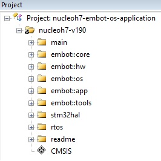
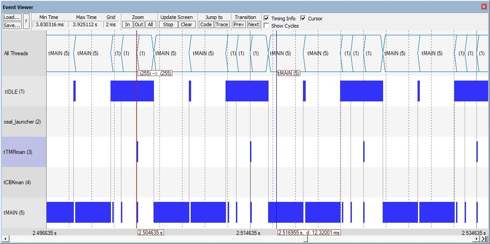

# Brief explanation of the application


In here we write a brief description of the application running on the nucleoh7 board. 


[TOC]


## Purpose of the application

This application is a test program which interfaces over I2C a number of sensors:

- one IMU Bosch BNO055,
- one ADC ADS122C04 chip with two input channels,
- two CDC AD7147 chips, which interface a skin patch former by 24 taxels.


## What the application does

The application initializes the chip `BNO055`, the `ADS122C04` and two `AD7147`, starts a timer which triggers an acquisition chain every 10 ms and finally programs a GPIO to start data transmission over USART when triggered.

The acquisition chain is done in the order (IMU, ADC-channel1, ADC-channel2, CDC), where the two CDC sensors are read in multiplex mode at every cycle. The data collected is stored in RAM and is transmitted over USART in binary mode when the GPIO detects a request.

The application can be used for normal use when macro `macro_APPL_MODE_STANDARD` is defined but also to trace timing and and debug. In such a case pls use the other `macro_APPL*` macros inside the code.

In this application we use a multithread system based onto `embot::os` to run a a single thread called `tMAIN`. We use the `embot::os`  because it offers useful services and efficient event-based activation> However what the application does  can be implemented using any other execution framework such as a superloop with activation flags.


## Architecture of the application

This application runs with the `embot` environment which offers:

- with `embot::os`: an RTOS environment with a fully pre-emptive scheduler, a number of template for threads (event-driven, periodic, callback executors, ...), services such as `theTimerManager` which manages periodic or one shot timers and insure that the associated action is executed;
- with `embot::hw`: a a collection of device drivers for chips (e.g., `embot::hw::bno055` or `embot::hw::ad7147`) for required peripherals (e.g. `embot::hw::gpio`,  `embot::hw::i2c`) and communication (`embot::hw::can`); the `embot::hw` is built upon the STM32 HAL drivers and is portable across a number of STM32 MPUs and boards by using the definitions and constants and functions contained in  `embot::hw::bsp`;  
- with `embot::core`: a number of useful platform-independent functions and objects such as  `embot::core::now()` to get system time,  `embot::core::TimeFormatter` to express the time in string format and  `embot::core::print()` to print strings to the ITM port.
- with other namespaces  such as `embot::app` and `embot::tools`: a collection of utility objects used by the application which in our case are `embot::app::theLEDmanager` and `embot::tools::Histogram` . 

The STM32 HAL driver required by `embot::hw` is included in the application by means of  `stm32hal.h7.nucleoh7.v190.lib` and with the single inclusion API file `stm32hal.h`.

The RTOS required by `embot::os` is included in the application by means of `osal.cm4.dbg.lib` and of its single inclusion API file `osal.h`. The file `eventviewer.c` is a companion file which allows to visualize in the KEIL environment the context switching of the scheduled threads. 


In here are pictures of the various groups of the project.



**Figure**.  The groups of the project.


## How the application works

The applications starts from `main()` and launches the `embot::os` environment in the following way.


```C++
int main(void)
{ 
    // configuration of the embot::os environment
    constexpr embot::os::InitThread::Config initcfg = { 4*1024, initSystem, nullptr };
    constexpr embot::os::IdleThread::Config idlecfg = { 1024, nullptr, nullptr, onIdle };
    constexpr embot::core::Callback onOSerror = { };
    constexpr embot::os::Config osconfig {1000*embot::core::time1microsec, initcfg, idlecfg, onOSerror};
    
    // embot::os::init() internally calls embot::hw::bsp::init() which also calls embot::core::init()
    embot::os::init(osconfig);
    
    // now i start the os
    // at first it is executed the tINIT thread in exclusive mode which calls initSystem() to init 
    // user defined threads and then stops execution allowing the system to schedule all other threads. 
    // note: function embot::os::start() is marked [[noreturn]] and hence ... it never returns     
    embot::os::start();   
}
```

**Code Listing**.  The main().


The initialization function starts some `embot` services, such as `theTimerManager`, and then creates a single application thread called `tMAIN` .


```C++
void initSystem(embot::os::Thread *t, void* initparam)
{
    
    embot::os::theTimerManager::getInstance().start({});     
    embot::os::theCallbackManager::getInstance().start({});  
    
    static const std::initializer_list<embot::hw::LED> allleds = {embot::hw::LED::one};  
    embot::app::theLEDmanager &theleds = embot::app::theLEDmanager::getInstance();     
    theleds.init(allleds);    
    theleds.get(embot::hw::LED::one).pulse(2*embot::core::time1second); 
        
    embot::os::EventThread::Config tMAINconfig { 
        6*1024, 
        embot::os::Priority::high40, 
        tMAIN_startup,
        nullptr,
        50*embot::core::time1millisec,
        tMAIN_onevent
    };
        
    // create the main thread 
    thr = new embot::os::EventThread;          
    // and start it
    thr->start(tMAINconfig, tMAIN);   
}
```

**Code Listing**.  The startup of the system.


In this case, the thread `tMAIN` is an event-driven thread which executes a `tMAIN_startup()` function and then it executes function `tMAIN_onevent()` only when some entity sends an event to it. In such a case it does what it must and then it returns control to the scheduler which in most cases will execute the `tIDLE` thread. 

In the picture below there is the thread activation diagram for our application. We can see that the thread `tTMRman` which belongs to `theTimerManager` service executes every 10 ms and triggers the execution of the thread `tMAIN` . 




**Figure**.  The thread activation diagram.


All such behaviour is initialized in function `tMAIN_startup()` as following code shows.


```c++
static void s_chips_init()
{
	...
    
    constexpr uint32_t i2cspeed = 400000;  
    
    embot::hw::bno055::Config bno055config { embot::hw::i2c::Descriptor { embot::hw::I2C::one, i2cspeed } };
    embot::hw::bno055::init(embot::hw::BNO055::one, bno055config); 
    
    constexpr embot::hw::bno055::Mode mode = embot::hw::bno055::Mode::ACCGYRO;
    constexpr embot::core::relTime timeout = 5*embot::core::time1millisec;
    embot::hw::bno055::set(embot::hw::BNO055::one, mode, timeout);   

    embot::hw::ads122c04::Config adsconfig { embot::hw::i2c::Descriptor { embot::hw::I2C::one, i2cspeed } };
    embot::hw::ads122c04::init(embot::hw::ADS122C04::one, adsconfig);   

    embot::hw::ad7147::Config skconfig { embot::hw::i2c::Descriptor { embot::hw::I2C::one, i2cspeed } };
    embot::hw::ad7147::init(embot::hw::AD7147::one, skconfig);
    embot::hw::ad7147::init(embot::hw::AD7147::two, skconfig);  
    
	...
    
}

void txrequest(void *p)
{
    embot::os::Thread *t = reinterpret_cast<embot::os::Thread *>(p);
    t->setEvent(evtDATAtransmit);
}

void tMAIN_startup(embot::os::Thread *t, void *param)
{  
    // init imu + adc + cdc
    s_chips_init(); 

#if defined(macro_enableEXTItransmit)
    // init the ext interrupt button
    embot::hw::button::init(buttonTX, {embot::hw::button::Mode::TriggeredOnRelease, {txrequest, t}, 0});
#endif
    
    ...    
    embot::os::Timer *tmr = new embot::os::Timer;   
    embot::os::Action act(embot::os::EventToThread(evtAcquisition, t));
    embot::os::Timer::Config cfg{acquisitionPeriod, act, embot::os::Timer::Mode::forever, 0};
    tmr->start(cfg);      
    ...    
}
```

**Code Listing**.  The startup of thread `tMAIN`.


As first thing, the function `tMAIN_startup()` initializes the chips and the external interrupt responsible to issue a transmission request over USART.

Then it starts a timer which sends every 10 ms the event `evtAcquisition` which starts the acquisition chain from the chips


The actions which the thread tMAIN executes upon reception of the above events can seen in the following code.


```c++
void tMAIN_onevent(embot::os::Thread *t, embot::os::EventMask eventmask, void *param)
{    
    if(0 == eventmask)
    {   // timeout ...          
        return;
    }

    if(true == embot::core::binary::mask::check(eventmask, evtAcquisition)) 
    {
        numberofCYCLE++;
        
#if defined(macro_enableTRACE_activations)        
        embot::core::TimeFormatter tf(embot::core::now());        
        embot::core::print("tMAIN_onevent(): evtAcquisition received @ time = " +
                           tf.to_string(embot::core::TimeFormatter::Mode::full));    
#endif          
        s_imu_start();
        ...
    }
    ...
            
```

**Code Listing**. Start of the acquisition chain.


The acquisition chain starts with the the IMU with a call to the following code which:

- logs the time of beginning of acquisition,
- starts a reading request of IMU data in non-blocking mode with a termination callback which sends an event  `evtIMUdataready` to the `tMAIN` thread.


```C++
void alertimudataisready(void *p)
{
    thr->setEvent(evtIMUdataready);
}

static void s_imu_start()
{
    imu_start = embot::core::now();
    embot::core::Callback cbk(alertimudataisready, nullptr);
    embot::hw::bno055::acquisition(embot::hw::BNO055::one, embot::hw::bno055::Set::A, data, cbk);    
}
```

**Code Listing**.  The reading request issues to the IMU.


When the IMU data is ready, the I2C handler sends the activation event to the `tMAIN` which executes the following code to:

- retrieve IMU data,
- log the time of completion of acquisition,
- start the acquisition of the second sensor in the chain

And the acquisition chain goes on until the last sensor is read. All data retrieved by the sensors is cached in an array which is transmitted when the event `evtDATAtransmit` arrives, triggered by the button initialized in function `tMAIN_startup()`.


```c++
static void s_imu_get()
{
    imu_stop = embot::core::now();
    imu_acquisitiontime = imu_stop - imu_start;
    acc2transmit = {data.acc.x, data.acc.y, data.acc.z}; 

#if defined(macro_enableTRACE_histograms)    
    histoIMU->add(imu_acquisitiontime);
    ...
#endif        
}

void tMAIN_onevent(embot::os::Thread *t, embot::os::EventMask eventmask, void *param)
{    
	...
    
    if(true == embot::core::binary::mask::check(eventmask, evtIMUdataready))
    {
#if defined(macro_enableTRACE_activations)        
        embot::core::TimeFormatter tf(embot::core::now());        
        embot::core::print("tMAIN_onevent(): evtIMUdataready received @ time = " +
                           tf.to_string(embot::core::TimeFormatter::Mode::full));    
#endif        
        s_imu_get();
        timeadc_start[0] = embot::core::now();
        s_adc_start(embot::hw::ads122c04::Channel::one); 
        timeadc_duration_of_acquisition_start[0] = embot::core::now() - timeadc_start[0];         
    }

```

**Code Listing**.  The retrieval of data the IMU has just sent.


```c++
void tMAIN_onevent(embot::os::Thread *t, embot::os::EventMask eventmask, void *param)
{    
    ...
        
    if(true == embot::core::binary::mask::check(eventmask, evtDATAtransmit))
    {
#if defined(macro_enableTRACE_activations)        
        embot::core::TimeFormatter tf(embot::core::now());        
        embot::core::print("tMAIN_onevent(): evtDATAtransmit received @ time = " + tf.to_string());    
#endif        
        s_transmit();
    }
}

```

**Code Listing**.  The transmission of data over USART.


## The sensors' drivers


The drivers of the sensors are implemented in the `embot::hw` namespace under these sub-namespaces:

- the IMU is in `embot::hw::bno055`
- the ADC is in `embot::hw::ads122c04`
- the CDC is in `embot::hw::ad7147`

They have dependencies from:

- `embot::hw::i2c` for the I2C communication driver,
- `embot::hw::bsp` for what may change from one board to another such as:
  - I2C pinout and handlers 
  - I2C addresses of the chips


