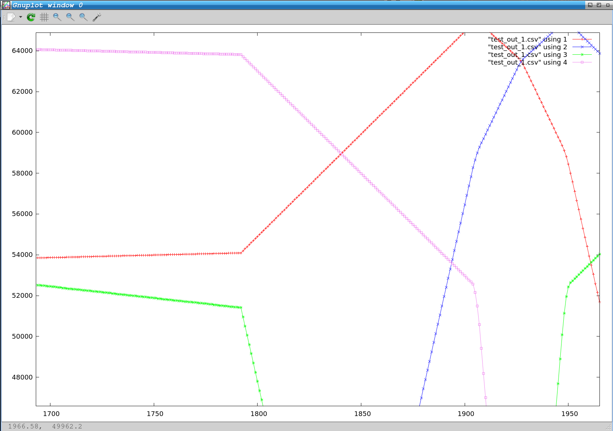

PMC Piezo motor driver
======================

This is triple-motor driver for PMC piezo subsystem. This is *heavily* based on G.Z. original code - thanks Giorgio :).

The PMC board has HW quirks that causes the three motors not to be independent. Initially I still thought a 1-motor driver could be written (and instantiated three times) but from time to time I changed my mind: it turned out that this is practically unfeasible; it's more than few SW hacks or quirks.

directory structure
-------------------

My 1st attempt is stored [here](./old). In this directory there are also [my considerations](old/README.md) about this.

The "real" PMC piezo driver is in the root directory, alongside this README, and it's basically [one single C file](./piezo_gz.c).

The driver does not explicitly includes STM HAL headers files; rather it includes [hal.h](hal.h). This serves for testing purposes: when the driver is linked with the test program, instead of the real application, *hal.h* is somehow replaced with a test version that implements emulations/stubs for HAL APIs.

The test program is [here](./test_gz)

The drivers needs special magic tables for driving motors. The table stuff is [here](./tables).

motor magic tables
------------------

A [python script](./faulhaber_csv_to_c.py) has been used to generate C tables from a reference file. Those files live in ["generated" directory](./tables/generated).

[This script](./gen/sh) is used to (re)-generate all the tables.

Finally, the intermediate CVS files could be plot running [plot.sh](./plot.sh). **NOTE**: you need a recent version of *gnuplot*

test bench
----------

The [test program](./test_gz/piezo_test.c) lives emulates the DMA and emulates the user trying to i.e. change speed, put the motor in brake state, etc..

The test programs can perform two checks:

- it automatically checks for the correct data formation in the DMA buffers (i.e. DACs are addressed correctly, LDAC command is present in right places); in case of errors, prints are spit out.

- it generates CVS files from the DMA data, that can be visually analyzed. From within the "test_gz" directory, the script [plot.sh](./plot.sh) can be invoked.

ARM demo
--------

The driver (i.e. the driver's directory) is stored inside the tree of an ARM demo program (generated with CubeMX).
The demo application tries to move three motors independently (and it tries to read the encoders). Note that this is Currently **completely untested** (however it compiles..).

configuration #defines
----------------------

There are some compile time defines. Some of them are probably part of magic recipes that no one really want to change. Some are just straightforward constants that have not to be changed. Few could be tweaked by the user.

`#define QUADSAMPLES_BUFFER_LENGTH   (256)`
The higher the value, the fewer the interrupts, the less critical the timing, the higher the latency to respond to user commands (i.e. velocity changes).

`#define PIEZO_RAMP_SAMPLES 10`
Number of points the driver will insert when ramping currents up/down. This should be chosen so that a transition from *BRAKE* to *FREEWHEEL* does not cause a spurious overcurrent fault. It depends by the motor model (i.e. parastic capacitance); choose the greatest of the three.

APIs
----

`void piezoInit(piezoMotorCfg_t *cfgM1, piezoMotorCfg_t *cfgM2, piezoMotorCfg_t *cfgM3)`:

Initialize the piezo driver. The three parameters contains configuration for each motors. Currently
the basically just serves for specifying the piezo table to be used.

`HAL_StatusTypeDef piezoSetStepFrequency(piezoMotor_t motor, int32_t freq)`

`HAL_StatusTypeDef piezoGetStepFrequency(piezoMotor_t motor, int32_t *pFreq)`

Setter and getter for the *frequency* of the piezo microstep. It is basically proportional to the motor speed.
It can be negative.

`HAL_StatusTypeDef piezoSetMode(piezoMotor_t motor, piezoMode_t mode)`

`HAL_StatusTypeDef piezoGetMode(piezoMotor_t motor, piezoMode_t *mode)`

Setter and getter for the motor operating mode. It can be one of the following values:

 - PIEZO_NORMAL: motor is running as per the *frequency* set by the user
 - PIEZO_BRAKE: motor is in *brake* state. i.e. it tries to stay still as much as it can and to avoid any compliance
 - PIEZO_FREEWHEELING: motor does not move by itself, but it's free to move.

`HAL_StatusTypeDef piezoGetState(piezoMotor_t motor, piezoMotorState_t *state)`

Returns the current motor state. It's useful to check for overcurrent. The state can be one of the following values:

 - STATE_NOT_INIT: piezo motor initialization has been not initiated/completed yet.
 - STATE_STEADY: piezo motor is not running (i.e. in either PIEZO_BRAKE or PIEZO_FREEWHEELING state).
 - STATE_OVERCURRENT: piezo motor in overcurrent state (i.e. protection engaged).
 - STATE_RAMPING: piezo motor is performing a state transition i.e. from a mode to another one.
 - STATE_NORMAL: piezo motor is in normal operation.

`HAL_StatusTypeDef piezoOvercurrentClear(piezoMotor_t motor);`

Clears the "overcurrent" protection state and re-enables the overcurrent protection.
In case of a HW failure the protection will likely to immediately retrigger.
This could be useful in case of a spurious overcurrent event (i.e. due to a too steep movement attempt).
**NOTE**: the motor will restart from the last working state before overcurrent event happened.

Waveform examples
-----------------

These waveforms have been generated with the testbench

Delta (8192 samples table) waveform example. Acceleration changing frequency from 5 to 200.

Detail of two delta waveforms with 8192 and 1024 samples table. Acceleration changing frequency from 5 to 200.

Detail of ramp on RUN->BREAK condition (delta waveform)

Detail of ramp on FREEWHEEL->RUN condition (delta waveform)

Rhomb (8192 samples table) waveform example

