# Scope of the document

In here it is described what is the stm32hal library, how to use it in an embedded application and how to generate it and how maintain it.


-------------------------

**Table of Contents**

[TOC]

# Description of the stm32lib


## In brief

The **stm32hal** is a wrapper for ST Microelectronics' **HAL driver** as customized by **CubeMX** which comes in form of a .lib file with API made available by a single and .h file. The use of **stm32hal** helps to reuse application code over multiple boards based on STM's MPUs. 


##  Naming convention

The focus of this document is a library focused to a given board which has a given MPU (micro processor unit) which belongs to a given family of STM. The library is based onto a HAL driver with a given version. 

Let's define some terms used through the document. A given term is enclosed inside `${..}`, it may be expresses with lower or with upper case such as `${x}` or `${X}` to refer to the same item written in lower or upper case,  and also, can come in normal or short version.  To better explain that, we use as an example the board RFE (Robot Face Expression).

- The board name is referred to with  `${b}` = `rfe` or  `${B}` = `RFE`.  This is the name defined by the HW engineer.
- The board  is built around a MPU which is referred by STM library with  `${M}` = `STM32L452xx` and with more detail inside the MDK option panel with `${D}` = `STM32L452CEUx` .
- The MPU belongs to a given family and refer to the family in many possible ways, both lower and upper case in minimal to long format. For the case of board RFE which belongs to family L4, from shortest to longest we use: 
  - `${f}` = `l4`,  `${F}` = `L4`, 
  - `${sf}` = `stm32l4`, `${SF}` = `STM32L4`,  
  - `${sfx}` = `stm32l4xx`, `${SFx}` = `STM32L4xx`.
- ST Microelectronics offers one STM32 HAL driver library per family, which it releases some times a year. We identify the driver version with `${v}` = `v183` and `${V}` = `V183`. This three character number is derived from the macro `__${SFx}_HAL_VERSION`  found inside file  `${sfx}_hal.h`. We use the most significant three bytes of which we use only the least significant nibble. For the `RFE` board the file is `stm32l4xx_hal.h`, the macro is  `__STM32L4xx_HAL_VERSION` whose its values is `0x01080300` and we extract `180`.

**TODO**: for the 0x value use full 4 bytes value.


## More details

The original goal of the **stm32hal**  was just to collect the result of the code generated by CubeMX into an easy to use library. The library avoids code duplication for applications which use the same code, speeds compilation time, simplify the aspect of complex projects.  Later on, it has helped us also to manage the continuous emission of new releases of the STM32 HAL drivers with possible change of API and also the easy porting of application code to MPUs belonging to new families.


Here is description of what ST offers and how we use it inside the stm32hal.


### What ST offer

ST offer fast software prototyping tools for its MPUs, namely **CubeMX** and the **HAL drivers** (**H**ardware **A**bstraction **L**ayer).

[CubeMX](https://www.st.com/en/development-tools/stm32cubemx.html) is used to model the peripherals of a ST's MPU as required by a given board and is able to generate a project with a simple main() application on several development environments (IAR, MKD ARM, gcc, etc.). 

It gives all is required to form a complete embedded application focused to HW manipulation:

- a startup .s file for the MPU with definition of the default IRQHandlers, stack / heap allocation, entry point for main() function;
- a file with the main() function which calls basic initialization of peripherals and has placeholders for user-defined code.
- initialization C code for the peripherals using calls to the STM32 HAL driver (for example: which pins are used for CAN or I2C1, which parts of the clock tree are used to offer a given speed to CPU and peripheral bus, etc.);
- access to the entire STM32 HAL driver of the MPU family (L4, H7, G4, etc.).  
- definition of suitable macros which shape the .c and .h files of the STM32 HAL driver to a specific MPU.

Any user-defined code can be placed into the placeholder, and is maintained through successive re-generations of code which may be required when a new release of the STM32 HAL drivers are issued, typically twice or three times a year.


### The needs of iCub-Tech embedded software

For iCub-Tech's boards we need several programs: some test applications, the bootloader, the updater of the bootloader, the final application. To simplify code development we favor re-usable software which should be as much as possible board-independent. 

For instance, we have a CAN protocol parser / former which is common to every board. It uses the services of a consolidated CAN communication driver which has advanced capabilities built on top of a typical HAL driver.  It has API which allow to retrieve received frames stored in RX queues, to put frames in TX queues, to activate their transmission, when all the activity mostly done in Handler mode or in HW.  

The above code code is shared amongst all applications in all CAN-based boards (strain2, mtb4, rfe, psc, etc.) and works like that by placing HW dependencies inside a hardware abstraction layer.

The abstraction layer we are using for STM32-based boards is obviously based on STM32 HAL driver which is packaged in such a way to offer an easy use and an easy management of possible change of APIs. This package is the **stm32hal library**.


### The components of stm32hal

The stm32hal library uses STM32 HAL and its configurations provided by CubeMX, adds to it some small enhancements and makes all that available in the form of a compiled library with a single include file. Here are the components of the stm32hal.

- A single inclusion file named `stm32hal.h`. 
- A template `stm32.startup.${b}.${v}.template.s` file. For the  `stm32hal.h7.nucleoh7.v180.lib` library we have an associated  `stm32.startup.nucleoh7.v180.template.s` file.
- A library file dedicated to a given board named `stm32hal.${f}.${b}.${v}.lib`. For example, for the board `nucleoh7` which uses an MPU of family `h7` built with the HAL driver version `0x01080000`  we have: `stm32hal.h7.nucleoh7.v180.lib`.
- One general macro named `USE_STM32HAL` which tells underlying layers that stm32hal is in use.
- The macro `STM32HAL_BOARD_${B}`,  ` STM32HAL_DRIVER_${V}`, which specify the board and the version of the driver. For instance, for board `nucleoh7` they are `STM32HAL_BOARD_NUCLEOH7` and `STM32HAL_DRIVER_V180`.
- A target device `${D}` to be used inside the project. For board `nucleoh7` we have`STM32H743ZITx` .


# How we use the stm32hal library

The use of the library by an application is simple: we define the relevant macros, include the `.lib` and the `.s` startup file, add source code which includes the `stm32hal.h` so that it can use all the functions provided by STM32 driver library.

## Detailed steps

Here are the steps in more details.

- Prepare a project `application.uvprojx` with a target configured as follows:
  - specify the correct device `${D}`. For nucleoh7 we use ` STM32H743ZITx` as in following picture.
  
    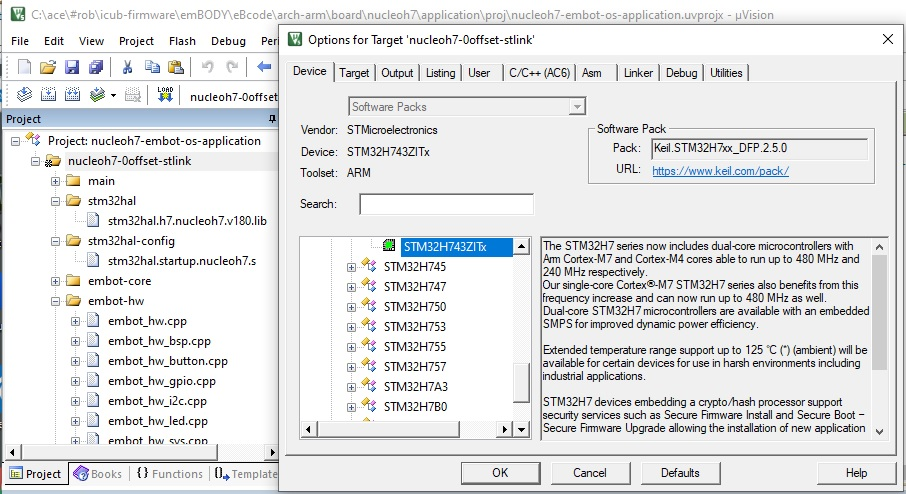
  
  - define the following three macros:  `USE_STM32HAL`,  `STM32HAL_BOARD_${B}`,  `STM32HAL_DRIVER_${V}`. For nucleoh7 we use: `USE_STM32HAL`,  `STM32HAL_BOARD_NUCLEOH7`,  `STM32HAL_DRIVER_V180` as in following picture.
  
    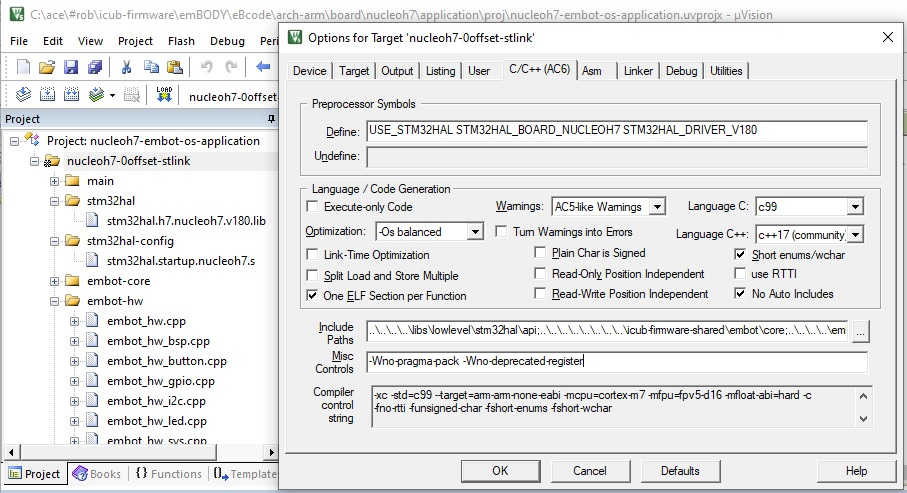
  
  - add inclusion path of `stm32hal.h`  as in following picture.
  
    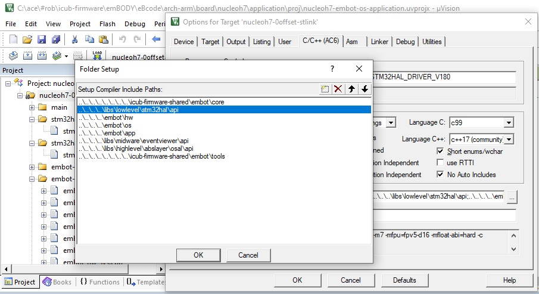
  
- Add `stm32hal.${f}.${b}.${v}.lib`  and a copy of `stm32.startup.{b}.{v}.template.s` properly modified to adjust stack and heap size. See picture. 

  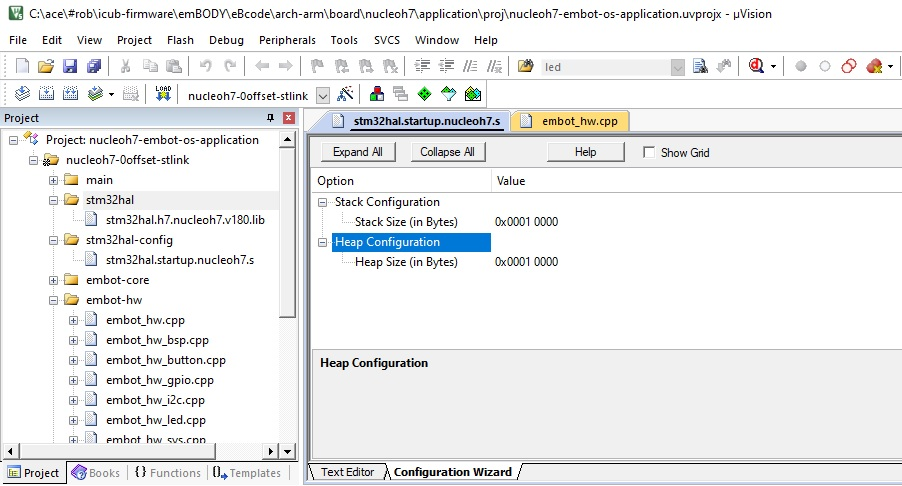

- Add a source file with a ` main()`  function and all the other files you need. Be sure to call `stm3hal_init()`  quite early in order to initialize the HW and after that you can freely use all functions provided by STM. To see  all the above, you must obviously include the ` stm32hal.h`  API header file.

  ```c++
  #include "stm32hal.h"    
  ```

  

## Code example of a basic stm32hal application

Here is a code excerpt which blinks a LED @ 1Hz on a ` nucleoh7`  board. Note that the code specific to board ` nucleoh7`  is limited to Figure 3.

```c++

#include "stm32hal.h"

// stm32hal requires two functions: one which inits and one that gets the 1 ms time.
static void stm32hal_tick1msecinit();
static uint32_t stm32hal_tick1msecget();
static const stm32hal_config_t systickcfg = { stm32hal_tick1msecinit, stm32hal_tick1msecget };

// they use STM32 HAL 
static void led_init();
static void led_toggle();

int main(void)
{ 
    stm32hal_init(&systickcfg);
    
    led_init();
        
    for(;;)
    {
        HAL_Delay(500);
        led_toggle();
    }    
}

```

**Figure 1**. Excerpt of the blinky program: the beginning. We use highly portable code.


```c++

// we need to provide stm32hal a timebase in units of 1 ms (as the hal driver by stm requires). 
// we can use what we want. typically it is used the systick timer which increments a volatile
// counter. the systick is initted @ 1 khz 

static volatile uint64_t s_1mstickcount = 0; // it must be volatile because it is used by an IRQ handler
constexpr uint32_t s_rate1khz = 1000;

void SysTick_Handler(void)
{
    s_1mstickcount++;
}

static void stm32hal_tick1msecinit()
{
    HAL_SYSTICK_Config(SystemCoreClock/s_rate1khz);
}

static uint32_t stm32hal_tick1msecget()
{
    return s_1mstickcount;
}

```

**Figure 2**. Excerpt of the blinky program: the time-based definition. We use ARM CMSIS functions.


```c++
// the led section. in our board the led is mapped in PB0

#if !defined(STM32HAL_BOARD_NUCLEOH7)
    #error this code is valid only onto board nucleoh7
#else

static void led_init()
{
    // start clock
    __HAL_RCC_GPIOB_CLK_ENABLE();
    
    // configure pb0
    GPIO_InitTypeDef GPIO_InitStruct = {0};
    GPIO_InitStruct.Pin = GPIO_PIN_0;
    GPIO_InitStruct.Mode = GPIO_MODE_OUTPUT_PP;
    GPIO_InitStruct.Pull = GPIO_NOPULL;
    GPIO_InitStruct.Speed = GPIO_SPEED_FREQ_LOW;
    HAL_GPIO_Init(GPIOB, &GPIO_InitStruct);
    
    // switch it off
    HAL_GPIO_WritePin(GPIOB, GPIO_PIN_0, GPIO_PIN_RESET);    
}

static void led_toggle()
{
    HAL_GPIO_TogglePin(GPIOB, GPIO_PIN_0);    
}

#endif

```

**Figure 3**. Excerpt of the blinky program: the LED management.  We use functions of the STM32 HAL driver and resources which are proper of the target board. 


# How to generate a stm32hal library

The creation of a stm32hal library is a process which requires some mechanical steps to be executed with some attention. If not, the library will not compile.

The prerequisite is that the Cube-MX project has generated an MDK-v5  project which uses the STM32 HAL library and a pair of .h/.c files for each HW peripheral. No middleware such as RTOS, special CMSIS libraries and others are needed and if they are added by Cube-MX code generator in the folders under the project they must be removed.


## The steps in brief

Here are the steps one must follow in the most complete case which is for a board which has a MPU which does not belong to an already supported family. 

- **Step A.**  Import the relevant **Cube-MX project**.
- **Step B.**  Define **the macros** which will shape all code for the compilation of the library. 
- **Step C.**  Adapt the **API** section.
- **Step D.**  Adapt the **source** section. It is formed of the following parts.
  - The **driver** part keeps the code which Cube-MX retrieves from the STM32 HAL and STM LL (Low Level APIs). 
  - The **board** part keeps parts of code used by Cube-MX for mapping and initialization of the peripherals.
  - The **config** part contains code with macros and ` #include`  and some functions which glue all together. 
- **Step E.**  Create a target inside a new or existing project which contains the SOURCE and compiles it to generate the library.
- **Step F.**  Provide a suitable startup file to be used in the MDK project.


We look now in more details how the above steps are  applied to the usual scenarios:

- we need a library for a board with an MPU of a family which is not supported yet.
- there is already a library for a given family but not yet for that board.
- there is a library for a given board but we need to update it to a new release of the STM32 driver. 


## Creation of the library in full

In here, there are steps to follow if there is not yet any support for the family or the board in the stm32lib.


### A. The Cube-MX project

Copy the MDK project generated by Cube-MX into the `stm32hal/cubemx/${b}` folder and make sure it compiles. 
Take note of: `${SFx}`, `${M}` and `${D}`. They will be used later on.

- `${SFx}` is found in the the file structure of the Cube-MX project: `stm32hal/cubemx/${b}/Drivers/${SFx}_HAL_Driver`.
- `${M}` is the macro defined inside the MDK project generated by Cube-MX in the tab `C/C++ (AC6)` of the window `Options for Target`  opened by menu `Project`. 
- `${D}` is the name of the device as reported in the tab `Device` of the  window `Options for Target`.

Here are the values for some boards.

| `${b}`      | `${SFx}`  | `${M}`      | `${D}`        |
| ----------- | --------- | ----------- | ------------- |
| rfe         | STM32L4xx | STM32L452xx | STM32L452CEUx |
| stm32g4eval | STM32G4xx | STM32G474xx | STM32G474QETx |

**Table**. Example of the values of the variables required in this step.


### B. The macros

Create some new macros which will shape any code of the .lib and of the APIs.
- `STM32HAL_BOARD_${B}`. This tells which board we use.

- `STM32HAL_DRIVER_${V}`. This tells which version of the HAL driver we use.

  

Here are the values for some boards.

| board       | `STM32HAL_BOARD_${B}`      | `STM32HAL_DRIVER_${V}` | `${D}` |
| ----------- | -------------------------- | ---------------------- | ------ |
| rfe         | STM32HAL_BOARD_RFE         | STM32HAL_DRIVER_V180   |        |
| stm32g4eval | STM32HAL_BOARD_STM32G4EVAL | STM32HAL_DRIVER_V180   |        |

**Table**. Example of the macros for some boards.

 


### C. The API

Adapt the files inside the `stm32hal/api` folder to manage the new `STM32HAL_BOARD_${B}` and `STM32HAL_DRIVER_${V}` macros.
    
- Edit file `stm32hal_define.h` and add a section which depends on `STM32HAL_BOARD_${B}`  and defines three other macros:
  - `${M}` and `${SF}`: they are used by STM32 HAL driver to shape its code,
  
  - `STM32HAL_${SF}`: it is used to shape user-code which uses the stm32hal library and includes file `stm32hal.h`. 
  
  Here is a code excerpt for board `${B}` = `STM32G4EVAL`. 
  
  ```C++
  #elif   defined(STM32HAL_BOARD_STM32G4EVAL)
        // it has a STM32G474xx mpu
      #if !defined(STM32G474xx)
      #define STM32G474xx
      #endif  

      // of family STM32G4
      #if !defined(STM32G4)
      #define STM32G4
      #endif  

      // of family STM32H7 but in STM32HAL_ format  
      #if !defined(STM32HAL_STM32G4)
      #define STM32HAL_STM32G4
      #endif  

  #else
      #error STM32HAL: you must define a STM32HAL_BOARD_${BRD}
  #endif
  ```


- Edit file `stm32hal_driver.h` to define the proper macros which identify the version of the HAL driver `${V}`.

    - the first macro to be defined is `STM32HAL_DRIVER_${V}` 
    - the second macro, `STM32HAL_DRIVER_VERSION` must be defined with a numeric value of the driver version.
    
    
  
  Here is a code excerpt for board `${B}` = `STM32G4EVAL` which uses  only `${V}` = `V111`.
  ```C++
  #elif   defined(STM32HAL_BOARD_STM32G4EVAL)
  
      // only one possible driver
      #if !defined(STM32HAL_DRIVER_V111)
          #define STM32HAL_DRIVER_V1111
      #endif
      #define STM32HAL_DRIVER_VERSION 0x111
    
  #else
      #error STM32HAL: the STM32HAL_BOARD_${BRD} is undefined
#endif
  
  ```
  **TBD** However, some boards may use two different versions of the driver, such as for the `strain2`. Maybe one version is the legacy version and another is for a new development. Here is how we manage that.
  
  ```C++
#elif   defined(STM32HAL_BOARD_STRAIN2)
  
      // three possible drivers. default is the 1B0 ...
      #if     defined(STM32HAL_DRIVER_V172)    
          #define STM32HAL_DRIVER_VERSION 0x172  
      #elif   defined(STM32HAL_DRIVER_V190)
          #define STM32HAL_DRIVER_VERSION 0x190
      #else   
          #if !defined(STM32HAL_DRIVER_V1B0)
              #define STM32HAL_DRIVER_V1B0
          #endif        
          #define STM32HAL_DRIVER_VERSION 0x1B0   
      #endif
      
  #elif   defined(STM32HAL_BOARD_RFE)
  ```
  
  
  
- Continue editing the file `stm32ha_driver.h` to define particular optional macros which may be required by particular versions of the driver. This section is optional, but if present it must come before the next one which loads the relevant include files for the STM32 HAL driver.   

  For example, see the following code excerpt where we use macro `STM32HAL_DRIVER_VERSION` to define some macros required by a change of API in the driver.

  ```C++
  // now extra code-shaping macros which depend on the family and the driver version 
  #if defined(STM32HAL_STM32L4)
    #if (STM32HAL_DRIVER_VERSION >= 0x183)
          // there is a new api for can
          #if !defined(USE_HAL_CAN_REGISTER_CALLBACKS)
          #define USE_HAL_CAN_REGISTER_CALLBACKS 1
          #endif  
      #endif
  #elif defined(STM32HAL_STM32H7)
      // nothing so far for can on h7
  #elif defined(STM32HAL_STM32G4)
      // nothing so far for can on g4
  #endif
  ```
  
  
  
- Continue editing the file `stm32hal_driver.h` to load the relevant include files provided by ST Microelectronics on the basis of the macros `STM32HAL_${SF}` and `STM32HAL_DRIVER_${V}` and of possible other macros defined in the optional section.

  Here is a code excerpt for the `STM32G4` family and the `V111` version of the HAL driver. It is worth to point out that the location of the file `stm32g4xx_hal.h` follows a particular rule which allows to separate the drivers by their version.  The rule will be explained in a future section.

  ```C++
  #elif defined(STM32HAL_STM32G4)
  
    #if     defined(STM32HAL_DRIVER_V111)    
          #include "../src/driver/stm32g4-v111/inc/stm32g4xx_hal.h"       
      #else
          #error STM32HAL: the STM32HAL_DRIVER_${V} is not managed
      #endif
      
  #else
      #error STM32HAL: the STM32HAL_${SF} is not managed
  #endif   
  ```
  
  **TBD** For the case of multiple driver versions we show another example of the we manage a new version `V1B0` for the `STM32L4` family.
  
  ```C++
  #if defined(STM32HAL_STM32L4)
  
      #if     defined(STM32HAL_DRIVER_V172)    
          #include "../src/driver/stm32l4-v172/inc/stm32l4xx_hal.h"       
      #elif   defined(STM32HAL_DRIVER_V183)        
          #include "../src/driver/stm32l4-v183/inc/stm32l4xx_hal.h"
      #elif   defined(STM32HAL_DRIVER_V190)        
          #include "../src/driver/stm32l4-v190/inc/stm32l4xx_hal.h"
      #elif   defined(STM32HAL_DRIVER_V1B0)        
          #include "../src/driver/stm32l4-v1B0/inc/stm32l4xx_hal.h"
      #else
          #error STM32HAL: the STM32HAL_DRIVER_${V} is not managed
      #endif
  
  #elif defined(STM32HAL_STM32H7)
      ...
  ```


- Edit the file `stm32hal_board.h` to include the API specific to the board support package provided by Cube-MX for a given board  `${b}` and a given version of the HAL driver  `${v}` .  The files to include are the following:

  - file `../src/config/stm32hal_driver_cfg_of_${b}_${v}.h` whose content will be defined in a later section.
  - file `../src/board/${b}/${v}/inc/main.h` which is the file generated by Cube-MX and which contains useful macros.
  - all the files `../src/board/${b}/${v}/inc/${everyperipheral}.h`, where `${everyperipheral}`  is the file name generated by Cube-MX which specifies code for initialization of the peripherals it has configured. Possible names are `can`, `dma`, `i2c`, `rng`, `tim`, etc.
  - the file `../src/board/${b}/${v}/inc/${sfx}_it.h`generated by Cube-MX containing the prototypes of the used IRQHandlers (maybe it can be dropped).

  

  See example for board `nucleoh7`.

  ```C++
  #elif   defined(STM32HAL_BOARD_NUCLEOH7) 
  
      // one case only: v180
      #if (STM32HAL_DRIVER_VERSION == 0x180)
  
          #include "../src/config/stm32hal_driver_cfg_of_nucleoh7_v180.h"
  
          #include "../src/board/nucleoh7/v180/inc/dma.h"
          #include "../src/board/nucleoh7/v180/inc/gpio.h"
          #include "../src/board/nucleoh7/v180/inc/i2c.h"
          #include "../src/board/nucleoh7/v180/inc/main.h"
          #include "../src/board/nucleoh7/v180/inc/usb_otg.h"
          #include "../src/board/nucleoh7/v180/inc/usart.h"
  
          #include "../src/board/nucleoh7/v180/inc/stm32h7xx_it.h"
  
      #else
          #error unsupported driver version for nucleoh7
      #endif
  
  #elif   defined(STM32HAL_BOARD_STM32G4EVAL) 
  ```


### D. The sources

In here we shall add the source code with relevant include files in a proper part of the tree structure.

At the end of the operation we shall have a tree below the folder `stm32hal/src` which contains code in this mode.

- Below `driver/`, in `${sf}-${v}/inc`  and `${sf}-${v}/src` there is a given version of the HAL driver. This code comes from the Cube-MX project with no modifications.
- In `config` we put a new file named `stm32hal_driver_cfg_of_${b}_${v}.h` which passes macros to the HAL driver shape its code. This file contains the file `${sfx}_hal_conf.h` which is generated by Cube-MX for that particular board.
- Finally, below `board/`, in `${b}/${v}/inc`  and `${b}/${v}/src` there is code which Cube-MX has generated for configuration of the peripherals of a particular board when it uses a given version of the HAL driver. This code comes from the Cube-MX project with very mild modifications.


The following figure shows the code tree for the case of board `stm32g4eval` with a STM32 HAL driver of family `stm32g` and version `1.1.1`.

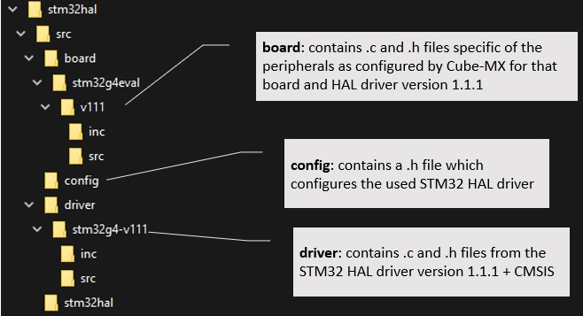


Here are more details.

#### The driver

In here we need to import the files of the STM32 driver and perform small changes to two of them so that the driver code is linked to the API previously defined.

- Create a new folder `${sf}-${v}/src` and copy in its inside:
  -  all .c files inside `stm32hal/cubemx/${b}/Drivers/${SFx}_HAL_Driver/Src`. **Important**: change the name of all files `*_template.c` files into `removed.*_template.c` and ... **don't** compile them into the library.
  - the file `system_${sfx}.c` from `stm32hal/cubemx/${b}/Drivers/CMSIS/Device/ST/${SFx}/Source/Templates`.

- Create a new folder  `${sf}-${v}/inc`  copy in its inside:
  -  all .h files inside `stm32hal/cubemx/${b}/Drivers/${SFx}_HAL_Driver/Inc`,
  - all .h files in `stm32hal\cubemx\${b}\Drivers\CMSIS/Include`,
  - all files in `stm32hal\cubemx\${b}\Drivers\CMSIS/Device/ST/${SFx}/Include`. 

- Now you must edit the following files as follow:
  - the file `${sf}-${v}/inc/${sf}_hal.h` must include in it file `stm32hal_driver_cfg.h` instead of the usual file`${sf}_hal_conf.h`
    ```C++
    // IIT-EXT
    #if defined(USE_STM32HAL)
    // path is referred to location of this file
    #include "../../../config/stm32hal_driver_cfg.h"
    #else
    #warning you are using a stm32hal file w/ USE_STM32HAL undefined ... are you sure?   
    /* Includes ------------------------------------------------------------------*/
    #include "stm32g4xx_hal_conf.h"
    #endif
    ```
  - the file `${sf}-${v}/inc/${sf}.h` must include file `stm32hal_define.h` before any other include.
    
    ```C++
    #ifdef __cplusplus
    extern "C" {
    #endif /* __cplusplus */

    // IIT-EXT
    #include "../../../../api/stm32hal_define.h"
...
    ```


#### The board

In here we add the files which Cube-MX has generated to specialize the board.

Look at the section `Application/User` in the MDK project and copy what it has in its inside:

- copy all its .c files into folder `stm32hal/src/board/${b}/${v}/src` and the relevant .h files into `stm32hal/src/board/${b}/${v}/inc`.
- copy also the files you don't need for the .lib: `main.c`, `${sfx}_it.c`, `system_${sfx}.c, ` `${sfx}_hal_conf.h`, etc. **but** rename them by adding a `removed.` prefix and **don't** add them to the project.
- keep: `main.h`.
- in every `*.h` file use `#include "stm32hal.h"` instead of what ST uses to see the driver, which typically is `#include ${sfx}_hal.h"`.


Then, add a file called `board_${b}_${v}.c` which contains: 

- a function `stm32hal_board_init()` with all the code which is inside the function `main() {}` generated by Cube-MX;
- the function `SystemClock_Config()` as generated by Cube-MX (**but** without any configuration of the systick);
- the function `Error_Handler()` as generated by Cube-MX.


#### The config

In here we connect together the code added  in previous sections.

- Add in file `src/config/stm32hal_driver_cfg.h` a section for `STM32HAL_BOARD_${B}` and the target `STM32HAL_DRIVER_VERSION` so that we can include the file `stm32hal_driver_cfg_of_${b}_${v}.h`.

  See code excerpt below for the case of board `stm32g4eval` which uses driver version 1.1.1:
  
  ```C++
  #elif   defined(STM32HAL_BOARD_STM32G4EVAL)
    
    #if (STM32HAL_DRIVER_VERSION == 0x111)
        #define USE_FULL_LL_DRIVER
        #include "../src/config/stm32hal_driver_cfg_of_stm32g4eval_v111.h"   
        // we also need some ll includes contained in the driver section
        #include "../src/driver/stm32g4-v111/inc/stm32g4xx_ll_gpio.h"
    #else
        #error unknown driver version
    #endif
 #else
        #error pls define a STM32HAL_BOARD_${BRD}
#endif
    
  ```

- Edit the file `stm32hal_driver_cfg_of_${b}_${v}.h` so that it includes the content of file `stm32l4xx_hal_conf.h` which Cube-MX has generated and placed into its `Inc` folder. You must also change the relative paths of the include files to refer to those inside `driver/${sf}-${v}/inc`. 

  See as an example the following code excerpt of file `stm32hal_driver_cfg_of_stm32g4eval_v111.h` 

  ```c++
  /*
   * Copyright (C) 2020 iCub Tech - Istituto Italiano di Tecnologia
   * Author:  Marco Accame
   * email:   marco.accame@iit.it
  */
  
  // - include guard 
  
  #ifndef _STM32HAL_DRIVER_CFG_OF_STM32G4EVAL_V111_H_
  #define _STM32HAL_DRIVER_CFG_OF_STM32G4EVAL_V111_H_
  
  #if !defined(USE_STM32HAL)
      #error USE_STM32HAL must be defined
  #endif
  
  #if !defined(STM32HAL_BOARD_STM32G4EVAL)
      #error STM32HAL_BOARD_STM32G4EVAL must be defined
  #endif
  
  //  TODO: 
  //  add the file stm32g4xx_hal_conf.h which cubemx has generated in here.
  //  and:
  //  1. change the prefix folder of include files of the driver by
  //     considering stm32hal/api as the starting point.
  //     so, for instance: stm32g4xx_hal_rcc.h becomes ../src/driver/stm32g4-v111/inc/stm32g4xx_hal_rcc.h
  //     the rule is to substitute `stm32g4xx_` with `../src/driver/stm32g4-v111/inc/stm32g4xx_`
  
  // insert between here and end of include-guard
  
  /**
    ******************************************************************************
    * @file    stm32g4xx_hal_conf.h
    * @author  MCD Application Team
    * @brief   HAL configuration file
    ******************************************************************************
   
   ...
    ...
    
  #endif /* STM32G4xx_HAL_CONF_H */
  
  /************************ (C) COPYRIGHT STMicroelectronics *****END OF FILE****/
  
  
  #endif  // include-guard of _STM32HAL_DRIVER_CFG_OF_STM32G4EVAL_V111_H__V180_H_
  
  ```

  


### The project

In here we add a target in the project `stm32hal/proj/stm32hal.{f}.uvprojx` which will build the library.  


- make a new target with following properties:

  - name:  `${b}-${v}`

  - Device:  `${D}`

    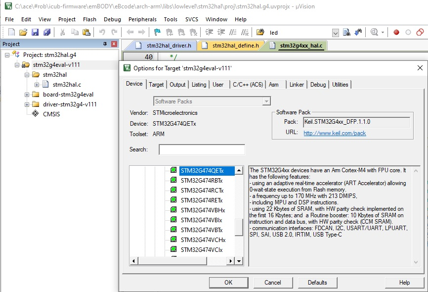

    

  - Code Generation: `Use default compliler version 6`.

    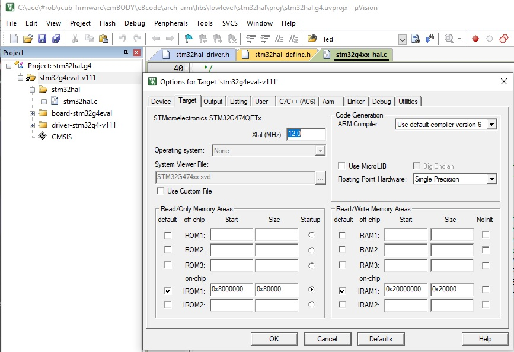

    

  - C/C++ define:  `USE_STM32HAL` `STM32HAL_BOARD_${B}` `STM32HAL_DRIVER_${V}` `${M}`

  -  C/C++ includes:  `..\api;..\src\driver\${sfx}-${v}\inc;..\src\board\${b}\${v}\inc`

  - C/C++ optimization  `-Os balanced`

  - C/C++ language: `C++14` , `C99`

    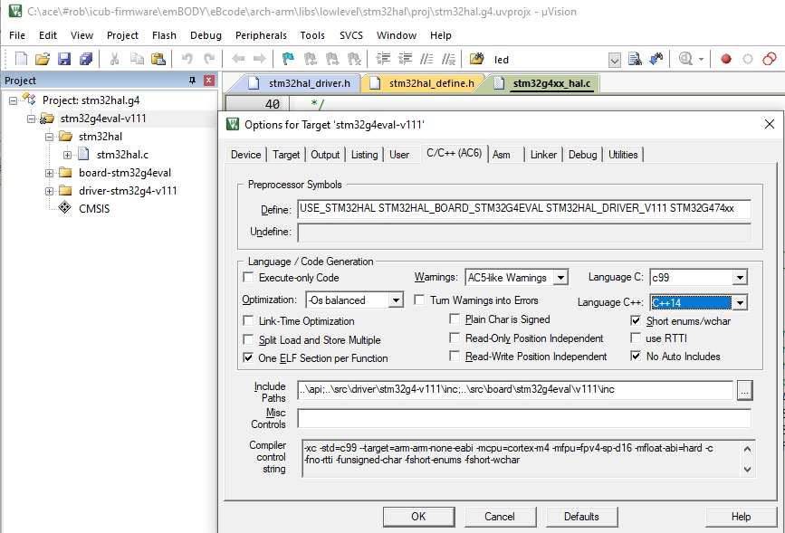

    

  - make sure to produce a library with the correct name `stm32hal.${f}.${b}.${v}.lib`.

    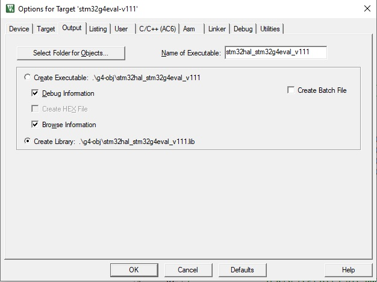

     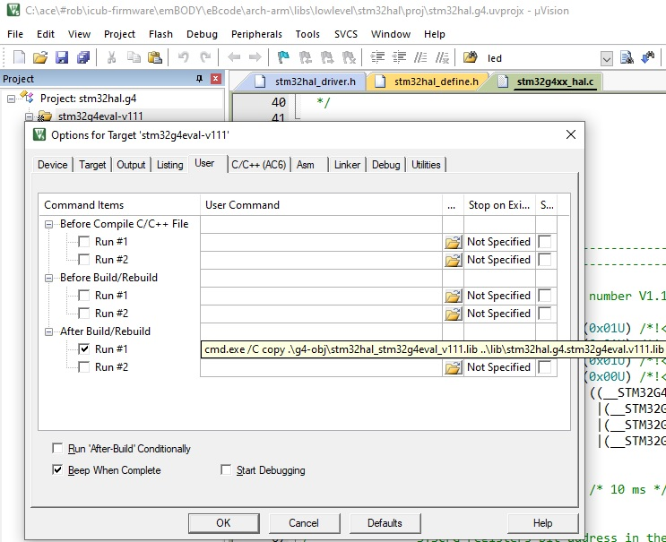


- add three code sections: `stm32hal`, `board-${b}` and `driver-${sf}-${v}` and add code in there.

  - in  `stm32hal` add `stm32hal.c`.

    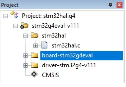

  - in  `board-${b}` add the code which you have just added inside  `stm32hal/src/board/${b}/${v}/src` 

    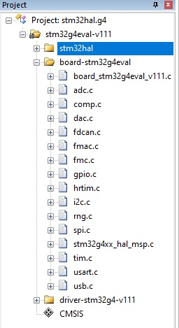

  - in  `driver-${sf}-${v}` add the code inside  `stm32hal/src/driver/${sf}-${v}/src`

    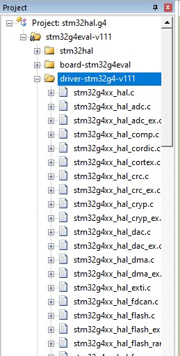


If everything is done correctly, the compilation of the project will produce the wanted library.


### The startup file

Copy the startup file used by the MKD project into folder `stm32hal/startup` with name `stm32hal.startup.${b}.{v}.template.s`


## Creation of the library for other cases

In here are instructions for the creation or a new library in special cases:

- update the library of a board to a new version.

- crate a new library for a new board to use an existing driver (equal in both family and version).

   

### Update the library of a board to a new version of the HAL driver

In such a case we just need to follow the general case in full with the following  except that we don't need to import the Cube-MX.

We need however, to ask Cube-MX to use the new latest driver and use them instead of the existing one.

In such a a case, take care of noting every possible change in the API of the HAL drivers.


### Create a library for a new board using an existing HAL driver

Follow instructions as for the general case with the exception of importing the code of the driver in folder `src/driver/` because it is already available.


