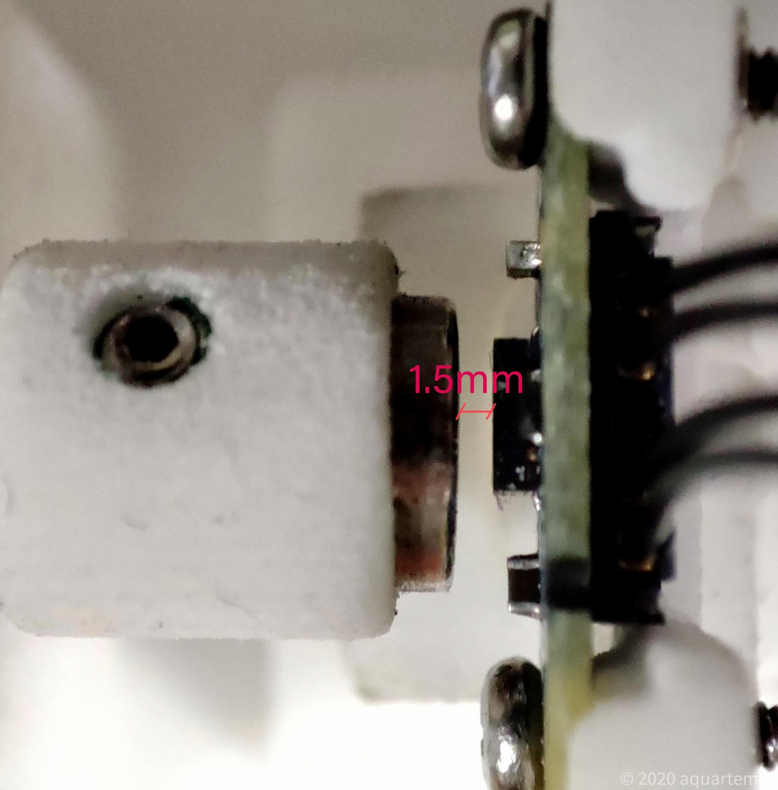
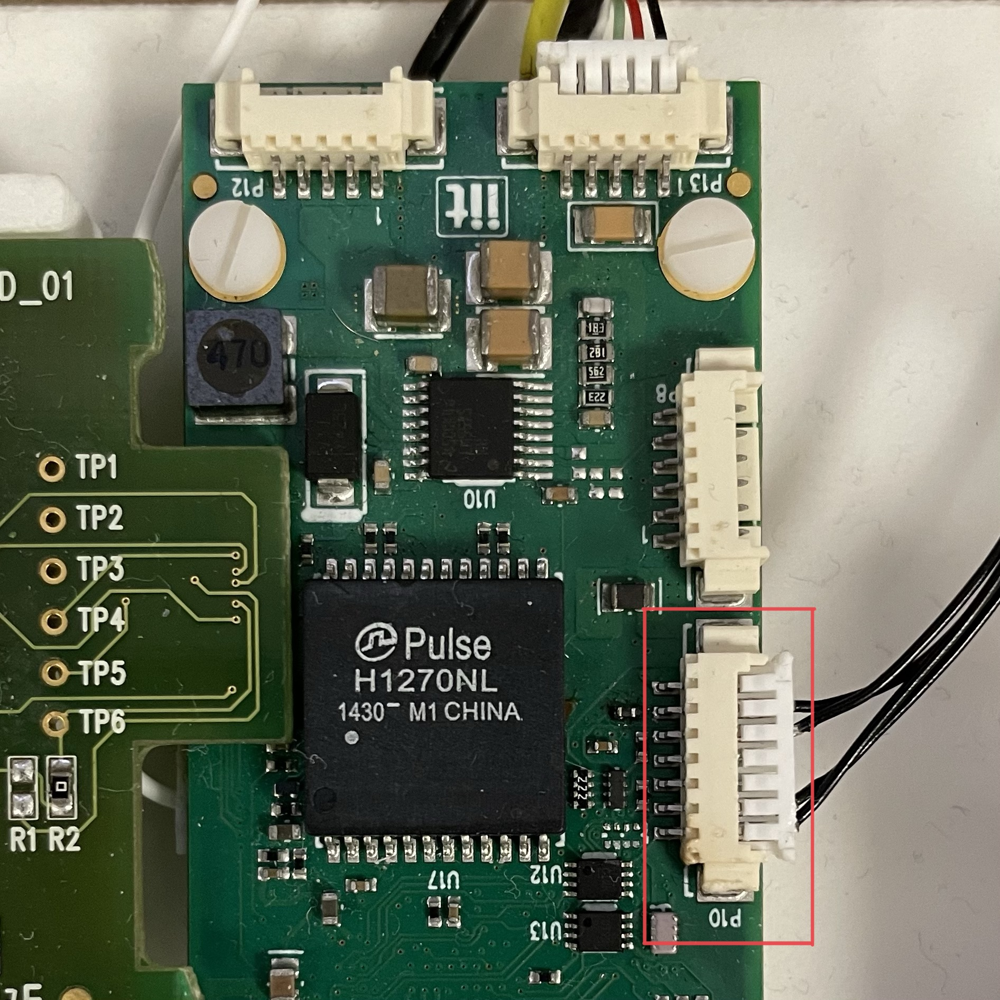

# The new Absolute Encoder Angle (AEA3)

The new AEA3 encoder is a [MagAlpha MA730](https://www.monolithicpower.com/en/documentview/productdocument/index/version/2/document_type/datasheet/lang/en/sku/MA730GQ-Z/document_id/3563) developed by Monolithic Power Systems.


## What's new?
- The new AEA3 encoder has a resolution of 14 bits, two more than the older AEA2.
- It is 88% less noisy than AEA2.
- Its mechanical shape is very similar to the AEA2, which results in a back-compatible mechanical assembly.


## Requirements
- mc4plus / ems4 / mc2plus board
- icub-firmware v1.22+
- robotology-superbuild v2021.08+


## How to use it?


### 1. Mount the encoder 

Check that the encoder is placed at the right distance from the magnet


<p align="center">
  <kbd></kbd>
</p>


### 2. Connect the encoder to the board

Take note of the port where the encoder will be connected to. You'll need this information in the next step.

<p align="center">
  <kbd></kbd>
</p>


### 3. Prepare the robots configuration files
Since it is a new type of encoder, you have to edit your robots configuration files. In particular under `<path-to-robots-configuration-folder>\<icub_robot_name>\hardware\motorControl\<joint_name>-mc_service.xml` you have to edit the `JOINTMAPPING` group. Within it find the group associated to the encoder that you want to replace. If it does not exist, you have to add it.

An example is illustrated in the following snippet:

```xml 
                ...
                <group name="JOINTMAPPING">
                    ...
                    <group name="ENCODER1">  
                        <param name="type">             aea3                  </param>  
                        <param name="port">             CONN:P10              </param>
                        <param name="position">         atjoint               </param> 
                        <param name="resolution">       16384                 </param>
                        <param name="tolerance">        0.703                 </param>  
                    </group>
                    ...
                </group>
                ...
```

**Note: To use the new AEA3, the only parameter you are allowed to change from the snippet above, is the `port` parameter**.


### 4. Calibrate the encoder

To calibrate the encoder you can follow the steps described in [Robot Calibration of iCub v2.X](https://icub-tech-iit.github.io/documentation/icub_robot_calibration/icub-robot-calibration-v2.x/#run-yarprobotinterface-in-calibration-mode).

⚠️ The calibration step has to be performed only the first time that a new encoder is installed/replaced.


### 5. Test the encoder

- Open a terminal and start the `yarpserver`.
- Open another terminal and run the following command:
 ```console
 yarprobotinterface --config <path-to-robots-configuration-folder>
 ```
 If everything is going well, the motor will turn until the joint has reached the zero-position.
- Start the `yarpmotorgui` and try to move the joint in different positions and velocities.
