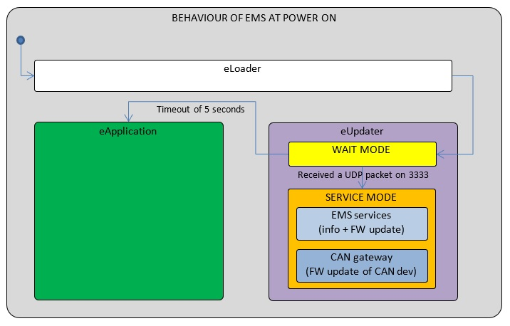
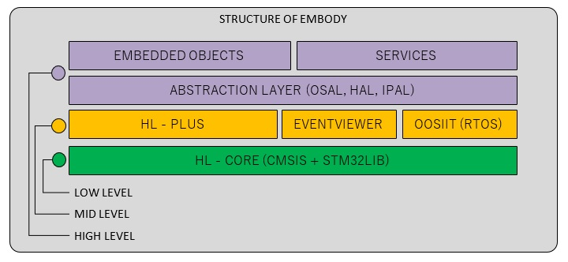

# ETH boards: software implementation

In here we attempt a description of the software running on the ETH boards (`ems`, `mc4plus`, `mc2plus`) with a focus on portability towards new boards built with upon newer Cortex-based MPUs.


[TOC]


On the ETH boards (ems, mc4plus, mc2plus) we compile the same bulk of code with minimal differences which are mainly related to the different peripherals attached to the boards. 

We can describe the code structure of an ETH board with two different views:

- the process view: we look at the different programs running in any given time on the ETH board: the `eLoader`, the `eUpdater`, the `eApplication`;
- the code structure view: we look at how are organized the layers of code or libraries which we have used to build the above processes. 


Here follows a description of both views.


## The processes in an ETH board

Any ETH board run three different programs (or processes) in different moments of their life. They are: the `eLoader`, the `eUpdater` and the `eApplication`.





### The `eLoader`

At boot, the processor executes the `eLoader`. It does some basic EEPROM checks (with first time initialization of a small database containing the type of board, MAC address, IP address, process jump table, etc.), it looks at the status of a given `RAM` location and then jumps to another process: either the `eUpdater` or the `eApplication`. 


### The `eUpdater` 

The `eUpdater` is a process which executes for 5 seconds and if it does not receive any UDP packet on a given port (3333), it makes a request to jump to the `eApplication`.  It does that by marking  a given `RAM` location and then forces a restart.  At this point the `eLoader` reads the `RAM`, understands the order and jumps directly to the `eApplication`.

We use the program `FirmwareUpdater` to talk to ETH boards running `eUpdater`. The `FirmwareUpdater` can request basic information about the board itself and the attached CAN boards (their FW versions, etc.) and it can perform maintenance on them (address changes, FW update, etc.)


### The `eApplication` 

The `eApplication` is the stable process run by the ETH board. Its main purpose is to offer service to `yarprobotinteface` to run the required services of motion control and sensors data streaming (FT, SKIN, IMU, etc.). 

Also, the `eApplication` keeps an open communication link with the `FirmwareUpdater`, which can request basic information about the board it can ask to execute the `eUpdater`.

#### Some more about the `eApplication`

As a result of that, the `eApplication` is much more complicated than the other two. 

It manages core services (CAN, EEPROM, NZI RAM, LEDs, UDP to `FirmwareUpdater`) but also it implement the logic of the control application as commanded by `yarprobotinterface`. 

And that is quite complicated matter. There is UDP communication towards `yarproborinterface` on a separate socket, diagnostics, real-time control loop at 1 KHz, CAN messaging in an asynchronous way, ETH and CAN protocol handling, management of some internal peripherals for reading AEA and AMO, management of board-dependent peripherals such as PWM and DAC. There is management of many services such as: motion control, skin, IMU, mais, FT, monitoring of the ETH switch. etc. and many services have been added over the years.


## The code structure on an ETH board

In order to better manage the complexity of the above processes, we have organized the code using abstraction layers to some services (HAL for the HW, OSAL for the RTOS, IPAL for the IP stack) and that we have organized on top of them more elaborate SW services, written in plain C, which are fully portable. This infrastructure is called `emBODY`.




**Figure**. The structure of the `emBODY`. The actual behaviour is built on top of three well separate libraries: HAL, OSAL, IPAL and it is mostly implemented using a library of embedded objects called `embOBJ`.


The basic architecture from bottom is formed as follows.

- The **abstraction layer** gives access to  Hardware, to a real time Operative System and to an IP stack with uniform API. It is formed by three nearly independent libraries called: **HAL**, **OSAL**, **IPAL**.
- Some **shared services** makes possible to very process to use the same code to manage data which must be shared amongst them, so that for instance we can store board information on EEPROM or to issue commands to other processes during the jump mechanism. 
- The **embedded objects** or **embOBJ** are C modules which use the abstraction layer. We use them to shape more complex behaviour. For instance, we have the `EOtheIPNET` object to offer socket-like services  in a multithread context on top of the IPAL. We have the `EOMtheEMSrunner` which runs a tight control loop where may run several services such as the FT sensor service, modeled by the object `EOtheSTRAIN`.


### The OSAL

The OSAL is based onto the KEIL-RTX RTOS and is still used in our latest projects even if there are new versions of this RTOS.

On 2019, I have tested the latest RTOS version, named CMSIS-RTOS2, and wrapped it inside the same API of the OSAL, but that is still work in progress. As there is for now no urgent need, this activity it will be finished and tested at a later moment. 

#### Portability

It can run without modifications on any MPU based onto cortex M3, M4 or M7 core. It is actually running on stm32f407, stm32l4, stm32f7, stm32g4, stm32h7. 


### The HAL

The HAL is an hand-make library which is based onto an old version of STM32 driver. 

#### Portability

The HAL library is portable if we develop the underlying code staring from what CUBE-MX gives us. However, for the new CAN-based boards (from mtb4 and strain2) we have dropped the HAL library in favor of the C++ `embot::hw` namespace library, built upon CUBE-MX. The  `embot::hw` namespace extends what STM32 does not give us, such for instance a buffered and thread-safe CAN driver.

If we want to maintain the footprint of the HAL library one quick solution is to wrap the `embot::hw` functions which we already have with C functions that  we already have and develop only the ones we don't have.


### The IPAL

The IPAL is based onto KEIL TCPnet version 4.3 which is quite old now. It still works on the ETH boards and maybe there is no need to change it. It is worth saying that TCPnet uses an RTOS-agnostic approach. It gives functions which must be called with proper timing inside a forever main loop or inside some threads of an RTOS. 

Since TCPnet there are more modern versions of IP libraries. In the past we have integrated lwIP in IPAL so hat it could be used as an alternative. But we dropped the activity for lack of time. The same ARM-KEIL has produced new versions of its IP stack.

**NOTE**

The `IPnet` service was built around the API of IPAL. For this reason, a change of the behavior of IPAL will require a change of `IPnet`.  Thus, a migration towards a new IP stack has some impact.

#### Portability

The IPAL is a self-contained library which gets its dependency from the HW by means of a few externally defined functions. They are passed to the library by means of function pointers at the call of function `ipal_initialise(cfg)`.  Hence, a true porting of  IPAL is not necessary: the IPAL can run without modifications on any MPU based onto cortex M3, M4 or M7 core.

So far we have used, however, only on stm32f407 and previously on stm32f307. 

However, some actions are required:

-  to implement the functions which manage the HW operations on ETH. See following table.
- To produce a suitable `ETH_IRQHandler()` which is able to pass the received ETH frame to IPAL and to alert the thread running the function  `ipal_sys_process_communication()` for its processing. See following code excerpt.


| Functions required by IPAL     | Description                            | Notes                                                        |
| ------------------------------ | -------------------------------------- | ------------------------------------------------------------ |
| `hal_eth_init(hal_eth_cfg_t*)` | it initializes the ETH driver          | It is passed to IPAL as function pointer with its `ipal_initialise()` function. The IPAL will call this function with an argument of type `hal_eth_cfg_t*` that it computes internally and fill with some function pointers needed by the `ETH_IRQHandler()`. They are: `hal_eth_frame_t * (*frame_new)(uint32_t size)` used by IPAL to get memory where copy the received ETH frame and `void (*frame_movetohigherlayer)(hal_eth_frame_t *frame)` used to move the copied memory in its inside queue. There is also a `void (*frame_alerthigherlayer)(void)` which is a user-defined function used to alert the user thread about an RX frame. |
| `hal_eth_enable()`             | it enables the ETH IRQ Handler         | It is passed to IPAL as a function pointer with its `ipal_initialise()` function |
| `hal_eth_disable()`            | it disables the ETH IRQ Handler        | It is passed to IPAL as a function pointer with its `ipal_initialise()` function |
| `hal_eth_sendframe()`          | it sends an ETH frame                  | It is passed to IPAL as a function pointer with its `ipal_initialise()` function |
| `ETH_IRQHandler()`             | it executes at reception of a EH frame | Its content depends on the chosen MPU. It must however call some functions similar to: `hl_eth_frame_new()`, `hl_eth_on_frame_received()`, `hl_eth_alert()`. Description of these functions below. |
|                                |                                        |                                                              |

**Table**. Functions externally required by IPAL.


```C++
void ETH_IRQHandler (void) {
    /* Ethernet Controller Interrupt function. */
    ...
    hl_eth_frame_t *frame = NULL; 
  
    // copy the frame into memory given by IPAL. 
    // hl_eth_frame_new() calls frame_new() which is the alloc_mem() from TCPnet (but another one of lwIP)
    frame =  hl_eth_frame_new(RxLen | 0x80000000);
    size = (RxLen | 0x80000000);
    if (frame != NULL) {
    sp = (U32 *)(intitem->rx_desc[i].Addr & ~3);
    dp = (U32 *)&frame->datafirstbyte[0];
    for (RxLen = (RxLen + 3) >> 2; RxLen; RxLen--) {
      *dp++ = *sp++;
    }
    ...
    // assign the memory to IPAL
    // hl_eth_on_frame_received() calls frame_movetohigherlayer() which is put_in_queue() from TCPnet
    hl_eth_on_frame_received(frame);
    ...
    // alert the user thread
    hl_eth_alert();
    ...
}        
        
```

**Code excerpt**.  Example of the `ETH_IRQHandlel()`.


### Most important shared services.

There are some services which may use abstraction layers or not and are used by all processes. Here are the most important ones.

#### Inter Process Communication

The mechanism which uses specific `RAM` location for deciding which process jump to is called Inter Process Communication,  `IPC` in short. It is implemented by excluding a particular RAM location for the use of the processes and by letting it un-initialized.

A process which wants to communicate to another process just marks some command bytes in this memory, put the ID of the process which must get the order, and finally adds a validity signature. Then it forces a reset or a jump to another process.

The process at startup will check if there is  a valid signature, if the ID of the destination is its own, and if so it gets the order.


#### Portability

They are portable as long as the relevant HAL functions are available.


### Most important `embOBJ` objects

The `embOBJ` library is a collection of data structures, types and C modules all organized in an uniform manner. We have a bulk set of code which forms the base of the library, the so called `embOBJ core` and then we have other code which depends on that and specializes services.

#### The core

The core of `embOBJ` contains types, data structures and simple C modules all with a uniform syntax. The core does not depend on a given abstraction layer and is fully portable. We use it on the ETH boards on ARM  but also on the Linux PC to run the modules started by `yarprobotinteface`. 

Here is some code excerpt of file `EoCommon.h` which holds most shared data types.

```C++
...
    
// - include guard ------------------------------------------------------------------------------
#ifndef _EOCOMMON_H_
#define _EOCOMMON_H_

#ifdef __cplusplus
extern "C" {
#endif
...
// - external dependencies ----------------------------------------------------------------------

#include "embOBJporting.h" // contains platform-dependant parts
...
    
    
/** @typedef    typedef uint32_t eOreltime_t
    @brief      eOreltime_t contains the relative time expressed in micro-seconds. It is used for 
                relative timing operations because its maximum value is about 4294 seconds. 
    @warning    It is strongly advised to use the associated eok_reltime* constants (e.g., 
                eok_reltime1sec etc.).
 **/
typedef uint32_t    eOreltime_t; 


/** @typedef    typedef uint64_t eOabstime_t
    @brief      eOabstime_t contains the time expressed in micro-seconds in a much longer range. 
                It is used for absolute timing, usually measured from bootstrap of the device. 
                A eOabstime_t variable keeps time up to 584 thousand years ...
 **/
typedef uint64_t    eOabstime_t; 
    
...
    
```

**Figure**. Code excerpt of file `EoCommon.h` which holds most shared data types


Examples of objects are: `EOdeque`, `EOfifo`, `EOlist`, `EOvector`, `Eoarray`, `EOtheMemoryPool`, `EOtheErrorManager`, `EOtimer`, `EOaction`, etc.

###### Portability

They are portable. Compilator issues are managed in a proper `embOBJporting.h` file.


#### Multitasking objects

There are then objects which are based onto the OSAL layer and that offer execution over a multitasking environment.  They are the following.

- the `EOMtheSystem`  which configures utility objects such as the `EOtheMemoryPool` and the `EOtheErrorManager`, prepares specific OS services such as the `EOMtheTimerManager` and the `EOMtheCallbackManager` , calls a user-defined function where to prepare other OS threads etc, and finally starts scheduling of the RTOS.

- The object `EOMtask` is the representation of a thread run by the scheduler. All them have an associated priority upon which are scheduled. Moreover, we the following execution modes:
  - event-based: the thread is in blocked mode until an event-flag arrives to it. If scheduled, it quickly executes what is associated to that event and then it blocks again;
  - message-based: as the event-based but the wake up action is a message received inside a FIFO. Even here execution must be short.
  - others: periodic, callback-driven, user-defined, etc.
  
- The object `EOMmutex` implements a recursive mutex for thread synchronization. 

- The  `EOMtheTimerManager` which accepts any user-defined `EOtimer` and ensure the execution of the associated `EOaction`. An action can be to send an event or a message to a thread or also to execute a callback.

- The `EOMtheCallbackManager` which has a dedicated thread for execution of callbacks.   


###### Portability

They are portable as long as the OSAL runs on the target.


#### The `IPnet` service

The aim of the  `IPnet` service is to offer socket-like services in a multithread context. It is built on top of OSAL, IPAL and HAL and uses some embedded objects `embOBJ`. The main ones are `EOMtheIPnet` and `EOsocketDatagram`, but others are also used such as `EOpacket`, `EOMtask`, `EOfifo` etc.


##### How we use it

A user thread can use the service in this mode.

- the thread creates a new  `EOsocketDatagram` object and it opens it with some parameters. In the following code snippet we open a socket for the main socket inside the `eUpdater`.

  ```C++
  const uint16_t capacityofUDPpacket = 1200;
  static EOsocketDatagram*        s_skt_ethcmd                = NULL;
  static EOpacket*                s_rxpkt_ethcmd              = NULL;
  static EOpacket*                s_txpkt_ethcmd              = NULL;
  static EOaction*                s_action_ethcmd             = NULL;
  
  static void s_ethcommand_startup(EOMtask *p, uint32_t t)
  {
      ....
          
     // init the rx and tx packets 
      s_rxpkt_ethcmd = eo_packet_New(capacityofUDPpacket);  
      s_txpkt_ethcmd = eo_packet_New(capacityofUDPpacket);
      // create the socket. it keeps two packets of up capacityofUDPpacket = 1200 bytes each in the input
      // queue and the same in the output queue.
      s_skt_ethcmd = eo_socketdtg_New(  2, capacityofUDPpacket, eom_mutex_New(), // input queue
                                        2, capacityofUDPpacket, eom_mutex_New()  // output queue
                                      ); 
      // init the action to be executed at rx of a packet inside the input queue
      EOaction* s_action_ethcmd = eo_action_New(); 
      // the rx action is that the IPnet will send a message s_message_from_skt_ethcmd to this task
      eo_action_SetMessage(s_action_ethcmd, s_message_from_skt_ethcmd, p);
      // open the socket at port s_ethcmd_port = 3333 to be bi-directional with callback on rx only
      // this operation will attach the socket to the IPnet service
      // the IPnet thread will do it when triggered by this call
      eo_socketdtg_Open(s_skt_ethcmd, s_ethcmd_port, eo_sktdir_TXRX, eobool_false, NULL, 
                        s_action_ethcmd, // action on rx 
                        NULL // action on tx
                        );
      
      // connect the socket to the host 10.0.1.104 with a 3 sec timeout
      // the IPnet thread will do it when triggered by this call. it will send arp messages.
      eo_socketdtg_Connect(s_skt_ethcmd, hostipaddr, 3000*eok_reltime1ms);
  ```

  

- The thread  reads a packet from the socket when alerted that a datagram is available or attempts to read it in polling mode. See code snippet below.

  ```C++
  // reads from the socket w/ infinite timeout and copy the packet inside s_rxpkt_ethcmd
  eOresult_t res = eo_socketdtg_Get(s_skt_ethcmd, s_rxpkt_ethcmd, eok_reltimeINFINITE);
  // use the packet
  eOipv4addr_t remaddr = 0; eOipv4port_t remport = 0;
  uint8_t *data =  NULL;
  uint16_t size = 0;
  eo_packet_Addressing_Get(s_rxpkt_ethcmd, &remaddr, &remport);
  eo_packet_Payload_Get(s_rxpkt_ethcmd, &data, &size);
  ...
  ```

  

- The thread transmits a packet by assigning it to the socket. See code snippet below.

  ```C++
  // send a packet. the destination (IP, port) and the payload are contained inside EOpacket.
  // for instance in here we send back the same packet we have just reveived:
  eo_packet_Full_Set(s_skt_ethcmd, remaddr, remport, size, data);
  eo_socketdtg_Put(s_skt_ethcmd, s_txpkt_ethcmd);
  ```

  

##### The internals

The `IPnet` service is implemented with object `EOMtheIPnet` and ` EOVtheIPnet` and is formed by two threads: `tsktick` and `tskproc`. 

The thread `tsktick` is periodic and just ticks the IPAL for timing purposes by calling `ipal_sys_timetick_increment()`.  

The thread `tskproc` is an event-based thread, it is activated by the ETH IRQhandler or by a user thread or by timeout every 20 milliseconds. Its activation always execute the main IPAL function `ipal_sys_process_communication()`, and upon cases may call several other IPAL functions. Here are the possible cases.

- When the user asks to attach a  `EOsocketDatagram` to the  `IPnet` service, the thread `tskproc` calls `ipal_udpsocket_new()`, `ipal_udpsocket_bind()` and finally `ipal_udpsocket_recv()` which registers a callback executed at reception of a datagram on the specified port. Such a callback may be for instance to send an event of value `eventRXdatagram` to a waiting thread. The `EOsocketDatagram`  socket is then inserted in an active list.
- When the user asks to transmit a datagram, the thread `tskproc` calls `ipal_udpsocket_sendto()` and then calls the callback associated to the relevant `EOsocketDatagram`  socket for completed transmission.
- When the user wants to detach a  `EOsocketDatagram` to the  `IPnet` service, the thread `tskproc` calls the proper function  `ipal_udpsocket_delete()` to remove the socket handle from the IPAL and then  re
- 
-  `ipal_udpsocket_bind()`, `ipal_arp_resolve()`, `ipal_udpsocket_recv()`,  `ipal_udpsocket_sendto()`,  `ipal_udpsocket_delete()`.

 which perform the calls to IPAL in a proper way. The user can create a number of objects `UDPsockect` which are then assigned to the `EOMtheIPnet` so that it can manage the UDP communication associated to it. In particular each socket can be defined as TX or RX or both, it can have a local port (obvious), it can tx to a given IP::port pair, it has user-defined callbacks for reception and for completion of transmission. etc.

- There are user-defined threads specified by the C object `EOMtask` which implement the logic of the running process.


##### Portability

Nothing to do if the same IPAL is maintained. If the IPAL changes or it adds RTOS in its inside this module is to be re-written as it was built upon existing IPAL implemented with TCPnet or with lwIP. 


## Implementation details for each process

Not every process is implemented in the same way. Each one takes from the `emBODY` structure only what it needs and (hopefully) not more. Here are further details.


### Code structure of the `eLoader`

The `eLoader`is very simple and easily portable. It manages EEPROM (read/write), it manages NZI RAM (read/write), it performs jump to other memory locations, it blinks LEDs. It does not manage any ETH communication. It may perform some under-the-hood initialization of the Micrel ETH switch (**TO BE VERIFIED**).

It runs a simple of main() code with C code in  **bare metal** and only some HAL calls. We don't init any IRQHandlers. We init the systick to blink LEDs only in case of jumping failure.


#### Porting the `eLoader` to another MPU

It is a matter of:

- producing a memory mapping for the new board with position in FLASH of the processes and address of the shared RAM used for IPC. Pls see file `eEmemorymap.h`.

- implementing some HAL functions of the following modules: `core`, `eeprom`, `unique id`, `sys`. See the following table for details.

  | HAL module   | Required functions                                           | Notes                                                        |
  | ------------ | ------------------------------------------------------------ | ------------------------------------------------------------ |
  | **core**     | `hal_core_init()`, `hal_core_start()`                        | It can wrap a basic init of the HW done w/ CubeMX            |
  | **eeprom**   | `hal_eeprom_init()`, `hal_eeprom_read()`, `hal_eeprom_write()`, `hal_eeprom_erase()` | On ETH boards the EEPROM is on I2C, hence it may get complex dependencies. However, it is supported also the emulated flash mode which just use read / write of FLASH pages. |
  | **uniqueid** | `hal_uniqueid_init()`, `hal_uniqueid_id64bit_get()`          | We need that for ensuring a different MAC address. On ETH boards we use a unique ID peripheral. |
  | **sys**      | `hal_sys_irq_disable()`, `hal_sys_systemreset()`, `hal_sys_canexecuteataddress()`, `hal_sys_executenowataddress()`,  `hal_sys_systick_sethandler()` |                                                              |
  | **led**      | `hal_led_init()`, `hal_led_on()`, `hal_led_off()`, `hal_led_toggle()` | The function `hal_led_toggle()` is not actually used but would complete the led module so that is ready for the `eUpdater` which uses it. |
  | others?      |                                                              |                                                              |

  **Table**. The HAL functions required by the `eLoader` including also those required by the shared services it uses.

  

  

**NOTE**

Most of the above functionalities in `core`, `sys`, `led` (and easily also emulated `eeprom`) are already available for newest stm32 MPUs using  the `embot::hw` namespace which extends the plain stm32hal library obtained with cube-mx. One smart solution could be to have the `hal_*` C functions which wrap the C++ `embot::hw` functions.


### Code structure of the `eUpdater`

The `eUpdater` is slightly more complicated than the `eLoader`, but not that much.  It manages EEPROM (read/write), it manages NZI RAM (read/write), it manages UDP communication to talks to the `FirmwareUpdater`, it uses CAN communication to talk to the attached CAN-based boards, it manages FLASH for read/write (as it is responsible of the update of the code space of the `eApplication`and of the `eLoader`) and it manages the 5 seconds countdown. It also blinks some LEDs. 

It uses the full `emBODY` code structure. 

The main() starts the  `EOMtheSystem` with the standard services (`EOtheErrorManager`, `EOtheMemoryPool`, `theTimermanager` and  `theCallbackManager`)  and then it calls the user-defined function which:  

- starts the  `IPnet` service,
- starts a countdown `EOtimer` which at its expire marks in RAM the request of execution of the `eApplication` and then forces a restart of the micro,
- starts the `EOtheLEDpulser` which blinks the LEDs with a given pattern,    
- starts a main message-based thread which manages eth communication over a bi-directional `EOsocketDatagram` listening on port 3333. This socket carries the updater protocol shared with the `FirmwareUpdater` and also the values of the FLASH used to perform FW update.
- starts a second event-based thread which acts as a gateway between the `FirmwareUpdater` and the CAN-based boards. This thread opens a `EOsocketDatagram` listening on port 3334 which carries CAN frames.  The execution of this thread is triggered either from the socket or from the CAN driver. 


#### Porting the `eUpdater` to another MPU

It is a matter of:

- having what is required by the `eLoader`: memory mapping + porting of some HAL functions as described before.

- building a porting for the `IPnet` service. See description in the relevant section.

- implementing some other HAL functions of the following modules: `flash`, `can`, `sys`. See the following table for details. 

  | HAL module | Required functions                                           | Notes                                       |
  | ---------- | ------------------------------------------------------------ | ------------------------------------------- |
  | **trace**  | `hal_trace_puts()`                                           |                                             |
  | **flash**  | `hal_flash_erase()`,  `hal_flash_write()`, `hal_flash_unlock()`, |                                             |
  | **5v**     | `hal_5v_init()`, `hal_5v_on()`                               | it switches  on the power to the CAN buses. |
  | **sys**    | `hal_sys_vectortable_relocate()`, `hal_sys_delay()`, `hal_sys_irq_enable()` |                                             |
  | **can**    | `hal_can_init()`, `hal_can_enable()`, `hal_can_received()`, `hal_can_put()`, `hal_can_get()`. |                                             |
  | ?          |                                                              |                                             |

  **Table**. The HAL functions required by the `eUpdater` including also those required by the shared services it uses but excluding those already inside the `eLoader` table.

  

  

**NOTE**

The multitasking objects such as `EOMtheSystem` ,  `EOMtask` et al, depends only on the `OSAL`, and there is no need to port any code of `OSAL` if the target MPU is a cortex M4 or M7.


**NOTE**

Most of the above functionalities in `trace`, `sys`, `flash` and `can` are already available for newest stm32 MPUs using  the `embot::hw` namespace which extends the plain stm32hal library obtained with cube-mx. One smart solution could be to have the `hal_*` C functions which wrap the C++ `embot::hw` functions so that we can exploit a well tested solution with mild modifications.


 

### Code structure of the `eApplication`

The `eApplication`  is built using the full `emBODY` structure.

A full description will follow.


#### Porting the `eApplication` to another MPU

As long as the `IPnet` works, we need to develop some functions from HAL. See the following table for details. 


| HAL module     | Required functions                                          | Notes                                                        |
| -------------- | ----------------------------------------------------------- | ------------------------------------------------------------ |
| **timer**      | `hal_timer_init()`, `hal_timer_start()`, `hal_timer_stop()` | they are needed by the control loop object. It is very important to have them. We can use the `embot::hw::timer` namespace for it. |
| **spiencoder** |                                                             | required to read the AEA and AMO.                            |
| **switch**     |                                                             | required to configure the switch and to retrieve statistics from it for diagnostic purpose. |
| **pwm**        |                                                             | required to move DC motors                                   |
| ?              |                                                             |                                                              |
|                |                                                             |                                                              |

**Table**. The HAL functions required by the `eApplication` including also those required by the shared services it uses but excluding those already inside the `eLoader` and `eUpdater`table.


